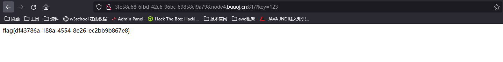

# [ACTF2020 新生赛]BackupFile

## 考点

- 备份文件泄露 https://blog.csdn.net/wy_97/article/details/78165051?depth_1-utm_source=distribute.pc_relevant.none-task&utm_source=distribute.pc_relevant.none-task
- php弱类型绕过

## 解题

访问`/index.php.bak` 下载源码

```php
<?php
include_once "flag.php";

if(isset($_GET['key'])) {
    $key = $_GET['key'];
    if(!is_numeric($key)) {
        exit("Just num!");
    }
    $key = intval($key);
    $str = "123ffwsfwefwf24r2f32ir23jrw923rskfjwtsw54w3";
    if($key == $str) {
        echo $flag;
    }
}
else {
    echo "Try to find out source file!";
}

```

使key为数值型，并且`==` 那个字符串

所以只要传值 `?key=123` 即可

