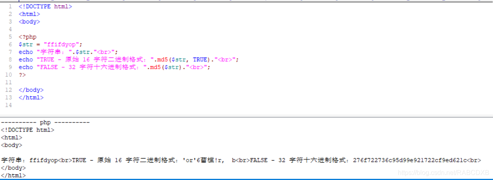
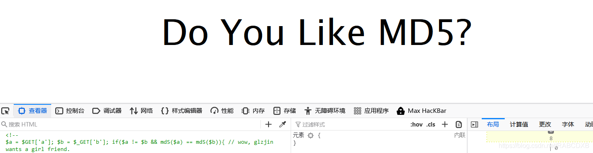
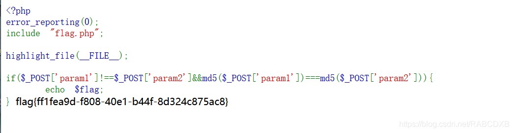

# [BJDCTF2020]Easy MD5

## 考点

- password=md5($pass,true)

- md5弱碰撞

- md5强比较

## 解题

### 1.password=md5($pass,true)

消息头里找到了一些线索




ffifdyop的md5是以 `' or '6`开头的，会引起sql注入，满足那条sql语句

### 2.md5若碰撞



寻找md5后开头是0e的字符串，0e在比较的时候会将其视为科学计数法，所以其后面无论是什么都无所谓,get传参

```
?a=QNKCDZO&b=s155964671a
```

### 3.md5强比较

```php
 <?php
error_reporting(0);
include "flag.php";
 
highlight_file(__FILE__);
 
if($_POST['param1']!==$_POST['param2']&&md5($_POST['param1'])===md5($_POST['param2'])){
    echo $flag;
?>
```

 **数组进行绕过**，因为md5不能处理数组，所以md5(param1[])返回false,===两边都返回false，自然就相等（同样弱比较也可以用数组绕过进行操作）

post传值 `param1[]=1&param2[]=2`

