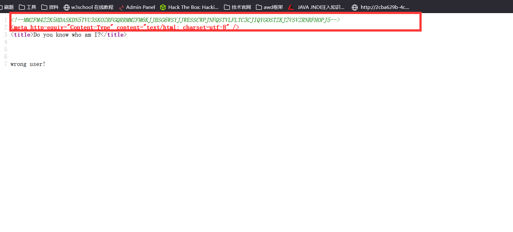
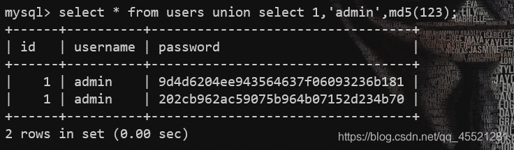

# [GXYCTF2019]BabySQli

https://github.com/imaginiso/GXY_CTF/tree/master/Web/BabySqli

## 解题



源码中有一段 加密文本

先经过base32解码，再经过base64解码

```
MMZFM422K5HDASKDN5TVU3SKOZRFGQRRMMZFM6KJJBSG6WSYJJWESSCWPJNFQSTVLFLTC3CJIQYGOSTZKJ2VSVZRNRFHOPJ5

base32解码
c2VsZWN0ICogZnJvbSB1c2VyIHdoZXJlIHVzZXJuYW1lID0gJyRuYW1lJw==

base64解码
select * from user where username = '$name'
```

这个题目解法基本上是通过联合注入，创建临时的一条记录，然后再登录
由于只能通过admin账户登录,因此让虚拟用户的名字是admin 同时密码转换成了md5存储(猜测应该是为了保护用户的隐私,md5不可逆,这就让即使身为管理员也不能知道用户密码)于是在构造的时候要注意数据库密码应该是md5模式的.同时登入时输入对应的明文密码即可.
至于从哪得知md5我目前也不知道。


使用union查询的时候，结果会有虚拟的数据

如上图，我们在users表中利用联合查询创建了一行虚拟的数据。



我们可以利用联合查询来创建一行admin账户的续集数据，混淆admin用户的密码，将我们自定义的admin用户的密码（123）加进去，这样我们不就可以登录admin用户了吗。

在用户名登录框输入1' union select  1,'admin','202cb962ac59075b964b07152d234b70'#其中202cb962ac59075b964b07152d234b70为123的MD5值，然后在密码登录框中输入123即可登录。