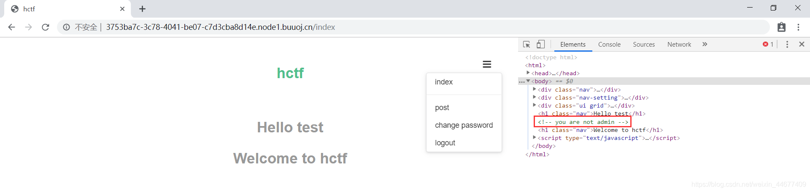
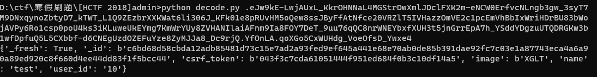
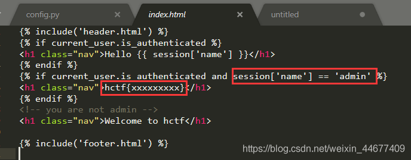
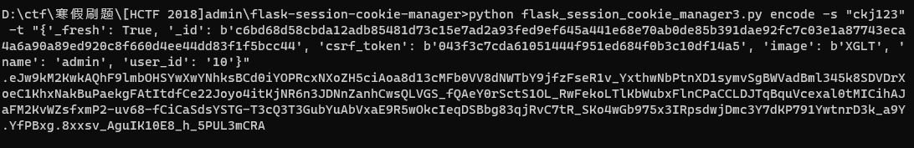
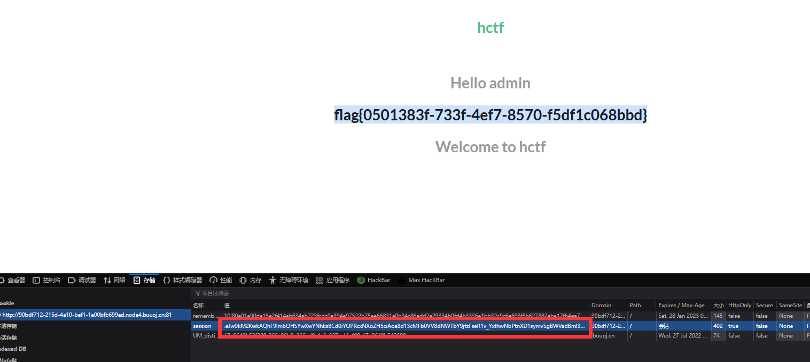
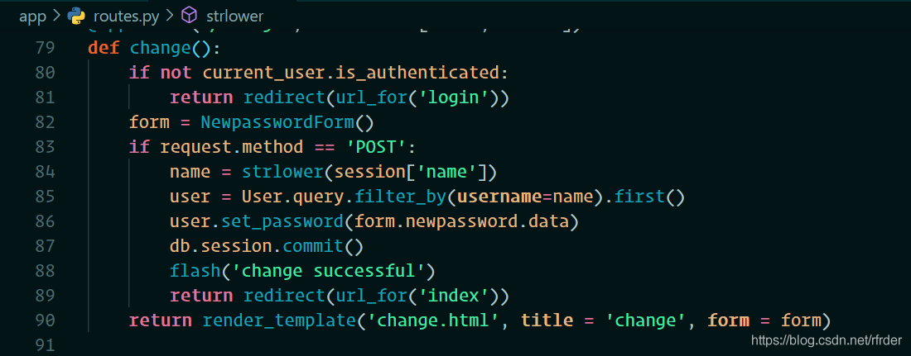

# [HCTF 2018]admin

登录之后查看源码发现提示`<!-- you are not admin -->`，根据提示和题目名估计要让我们登录admin用户就可以得到flag。



## 方法一：flask session伪造

flask中session是存储在客户端cookie中的，也就是存储在本地。flask仅仅对数据进行了签名。众所周知的是，签名的作用是防篡改，而无法防止被读取。而flask并没有提供加密操作，所以其session的全部内容都是可以在客户端读取的，这就可能造成一些安全问题。
具体可参考：
https://xz.aliyun.com/t/3569
https://www.leavesongs.com/PENETRATION/client-session-security.html#
通过脚本将session解密一下：

```python
#!/usr/bin/env python3
import sys
import zlib
from base64 import b64decode
from flask.sessions import session_json_serializer
from itsdangerous import base64_decode

def decryption(payload):
    payload, sig = payload.rsplit(b'.', 1)
    payload, timestamp = payload.rsplit(b'.', 1)

    decompress = False
    if payload.startswith(b'.'):
        payload = payload[1:]
        decompress = True

    try:
        payload = base64_decode(payload)
    except Exception as e:
        raise Exception('Could not base64 decode the payload because of '
                         'an exception')

    if decompress:
        try:
            payload = zlib.decompress(payload)
        except Exception as e:
            raise Exception('Could not zlib decompress the payload before '
                             'decoding the payload')

    return session_json_serializer.loads(payload)

if __name__ == '__main__':
    print(decryption(sys.argv[1].encode()))   

```



 但是如果我们想要加密伪造生成自己想要的session还需要知道SECRET_KEY，然后我们在config.py里发现了SECRET_KEY

然后在index.html页面发现只要session[‘name’] == 'admin’即可以得到flag



flask session加密的脚本 https://github.com/noraj/flask-session-cookie-manager
 利用刚刚得到的SECRET_KEY，在将解密出来的name改为admin，最后用脚本生成我们想要的session即可





## 方法二：Unicode欺骗



 更改密码的里面有这样一句代码：

```python
name = strlower(session['name'])
```

注意strlower:

```python
def strlower(username):
    username = nodeprep.prepare(username)
    return username
```

这里用到了`nodeprep.prepare`函数，而nodeprep是从twisted模块中导入的`from twisted.words.protocols.jabber.xmpp_stringprep import nodeprep`，在requirements.txt文件中，发现这里用到的twisted版本是`Twisted==10.2.0`，而官网最新版本为`19.2.0`(2019/6/2)，版本差距这么大，估计是存在什么漏洞，于是搜索一下`nodeprep.prepare`，找到一篇unicode安全的文章，[https://paper.tuisec.win/detail/a9ad1440249d95b](https://links.jianshu.com/go?to=https%3A%2F%2Fpaper.tuisec.win%2Fdetail%2Fa9ad1440249d95b)

这里原理就是利用nodeprep.prepare函数会将unicode字符`ᴬ`转换成`A`，而`A`在调用一次nodeprep.prepare函数会把`A`转换成`a`。
 所以当我们用`ᴬdmin`注册的话，后台代码调用一次nodeprep.prepare函数，把用户名转换成`Admin`，我们用`ᴬdmin`进行登录，可以看到index页面的username变成了`Admin`，证实了我们的猜想，接下来我们就想办法让服务器再调用一次nodeprep.prepare函数即可。

这个nodeprep.prepare存在漏洞。我们还会发现，login的时候又strlower一次。这个本来是转小写的，但是如果我们注册的用户名是这个：
ᴬᴰᴹᴵᴺ
login的时候会经过一次strlower会变成ADMIN,在change password的时候会变成admin。因此可以更改admin的密码，从而完成登录。

具体可查Unicode字符表https://unicode-table.com/en/search/?q=small%20capital


## 方法三：条件竞争

这个主要就是因为再session赋值的时候都是直接进行赋值，而并没有进行验证，也就是说，比如我们随便注册个用户123，然后进程1再使用用户123重复的进行登录，改密码操作，进程2重复进行注销登录，同时用admin用户和进程2修改的密码进行登录，然后某个时刻进程1刚好要修改密码，进程2恰好要登录，就将进程2 admin的session给了进程1，从而改掉了admin的密码

具体可以参考下面的文章：
[一题三解之2018HCTF&admin](https://www.anquanke.com/post/id/164086#h3-13)