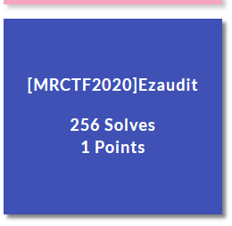
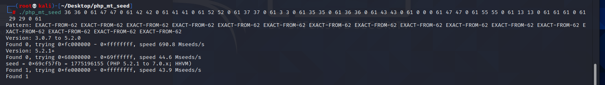
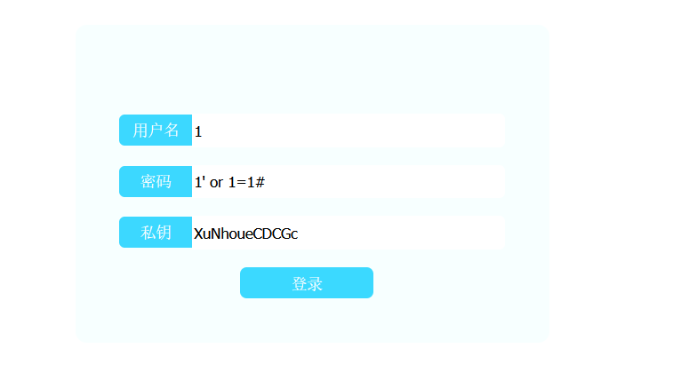
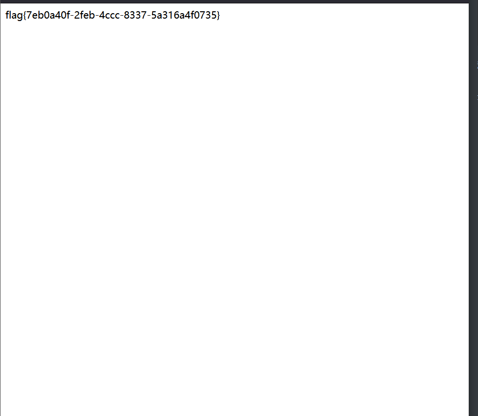

# [MRCTF2020]Ezaudit



## 知识点

- 源码泄露
- 伪随机数
- sql注入

## 解题

打开题目，扫目录发现`www.zip`源码泄露。

```php
<?php 
header('Content-type:text/html; charset=utf-8');
error_reporting(0);
if(isset($_POST['login'])){
    $username = $_POST['username'];
    $password = $_POST['password'];
    $Private_key = $_POST['Private_key'];
    if (($username == '') || ($password == '') ||($Private_key == '')) {
        // 若为空,视为未填写,提示错误,并3秒后返回登录界面
        header('refresh:2; url=login.html');
        echo "用户名、密码、密钥不能为空啦,crispr会让你在2秒后跳转到登录界面的!";
        exit;
}
    else if($Private_key != '*************' )
    {
        header('refresh:2; url=login.html');
        echo "假密钥，咋会让你登录?crispr会让你在2秒后跳转到登录界面的!";
        exit;
    }

    else{
        if($Private_key === '************'){
        $getuser = "SELECT flag FROM user WHERE username= 'crispr' AND password = '$password'".';'; 
        $link=mysql_connect("localhost","root","root");
        mysql_select_db("test",$link);
        $result = mysql_query($getuser);
        while($row=mysql_fetch_assoc($result)){
            echo "<tr><td>".$row["username"]."</td><td>".$row["flag"]."</td><td>";
        }
    }
    }

} 
// genarate public_key 
function public_key($length = 16) {
    $strings1 = 'abcdefghijklmnopqrstuvwxyzABCDEFGHIJKLMNOPQRSTUVWXYZ0123456789';
    $public_key = '';
    for ( $i = 0; $i < $length; $i++ )
    $public_key .= substr($strings1, mt_rand(0, strlen($strings1) - 1), 1);
    return $public_key;
  }

  //genarate private_key
  function private_key($length = 12) {
    $strings2 = 'abcdefghijklmnopqrstuvwxyzABCDEFGHIJKLMNOPQRSTUVWXYZ0123456789';
    $private_key = '';
    for ( $i = 0; $i < $length; $i++ )
    $private_key .= substr($strings2, mt_rand(0, strlen($strings2) - 1), 1);
    return $private_key;
  }
  $Public_key = public_key();
  //$Public_key = KVQP0LdJKRaV3n9D  how to get crispr's private_key???
```

根据最后一行知道，我们需要通过公钥找到私钥，这里使用`mt_rand()`函数

**爆破seed**

```python
str1='abcdefghijklmnopqrstuvwxyzABCDEFGHIJKLMNOPQRSTUVWXYZ0123456789'
str2='KVQP0LdJKRaV3n9D'
str3 = str1[::-1]
length = len(str2)
res=''
for i in range(len(str2)):  
    for j in range(len(str1)):
        if str2[i] == str1[j]:
            res+=str(j)+' '+str(j)+' '+'0'+' '+str(len(str1)-1)+' '
            break
print(res)
```

用php_mt_seed算出种子



计算私钥

```php
<?php
mt_srand(1775196155);
function public_key($length = 16) {
    $strings1 = 'abcdefghijklmnopqrstuvwxyzABCDEFGHIJKLMNOPQRSTUVWXYZ0123456789';
    $public_key = '';
    for ( $i = 0; $i < $length; $i++ )
    $public_key .= substr($strings1, mt_rand(0, strlen($strings1) - 1), 1);
    return $public_key;
  }

  //genarate private_key
function private_key($length = 12) {
    $strings2 = 'abcdefghijklmnopqrstuvwxyzABCDEFGHIJKLMNOPQRSTUVWXYZ0123456789';
    $private_key = '';
    for ( $i = 0; $i < $length; $i++ )
    $private_key .= substr($strings2, mt_rand(0, strlen($strings2) - 1), 1);
    return $private_key;
  }
echo public_key() . "<br>";
echo private_key();

?>
```

私钥：XuNhoueCDCGc

最后login.html输入即可得到flag



