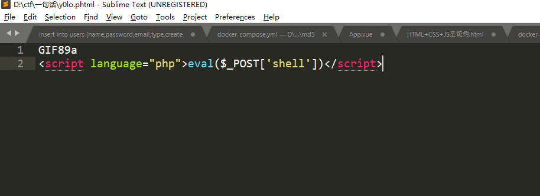
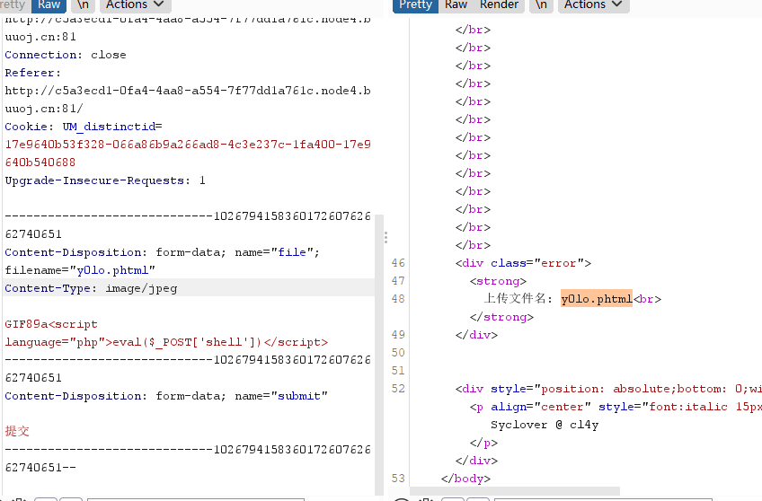
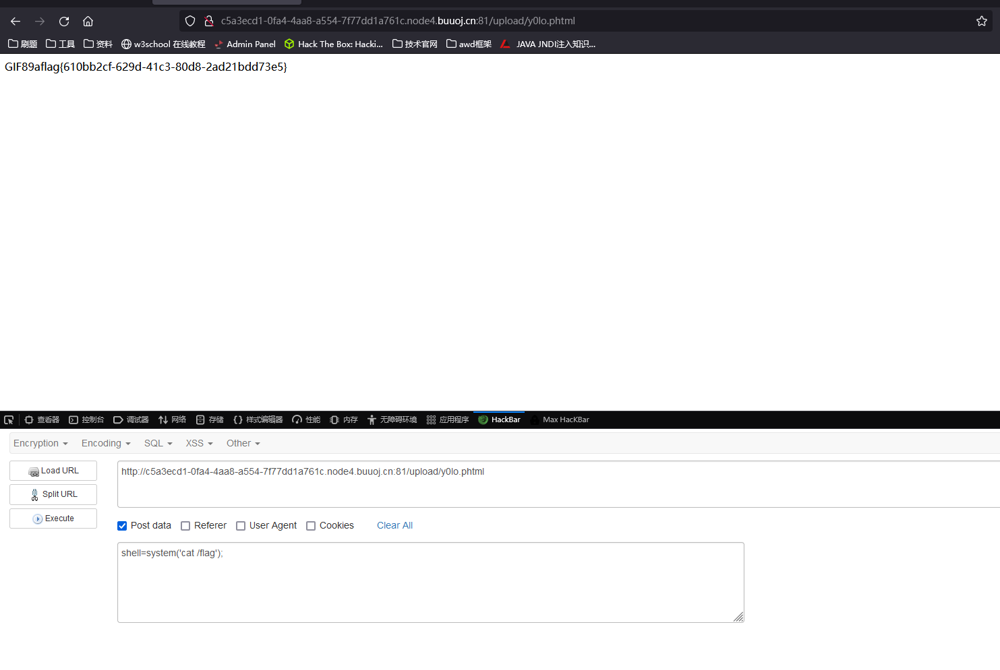

# [极客大挑战 2019]Upload

## 考点

- 文件上传
- 文件上传的绕过

	## 解题

修改Content-Type里面的格式改为image/jpeg

绕过后缀的有文件格式有php,php3,php4,php5,phtml.pht

前几个php格式的一句话都被b了

 将文件格式改到phtml可以了，但带<?的一句话都不行

 然后上传，抓包改文件格式为image/jpeg，上传成功。

