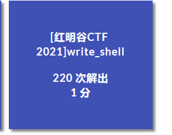
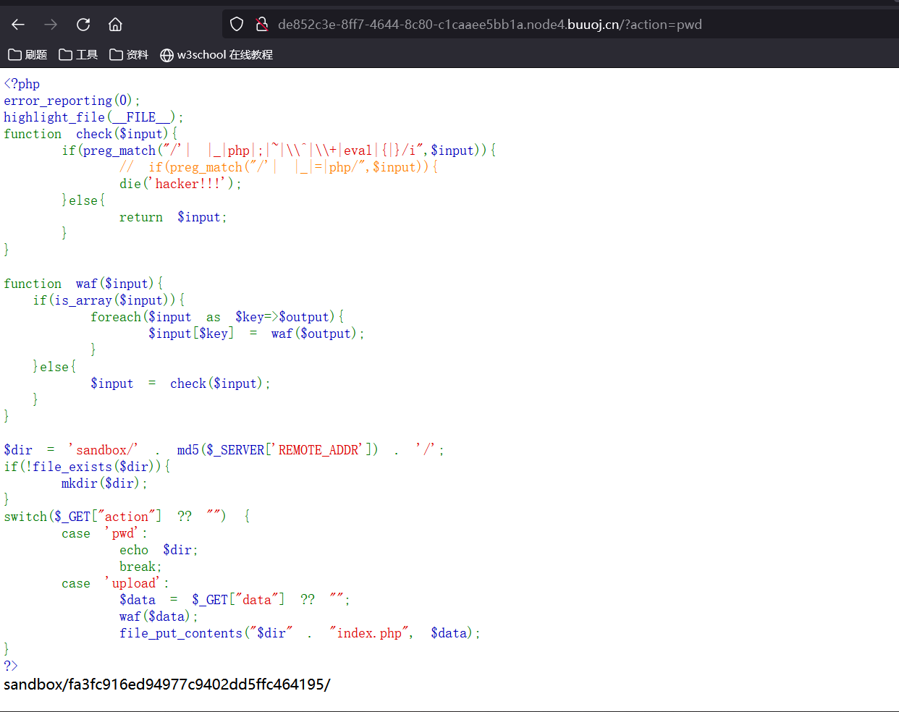
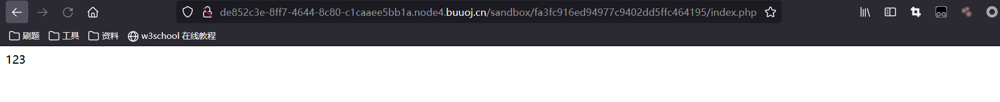
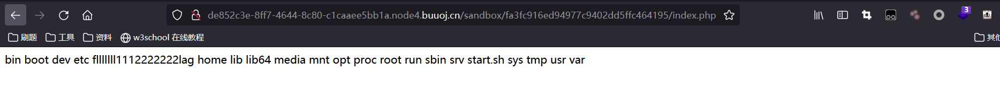
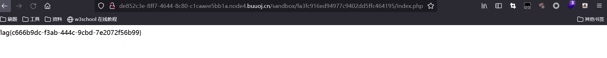

# [红明谷CTF 2021]write_shell



## 考点

- PHP执行运算符`(``)`

- PHP短标签`<?=?>`

## 解题

源码：

```PHP
 <?php
error_reporting(0);
highlight_file(__FILE__);
function check($input){
    if(preg_match("/'| |_|php|;|~|\\^|\\+|eval|{|}/i",$input)){
        // if(preg_match("/'| |_|=|php/",$input)){
        die('hacker!!!');
    }else{
        return $input;
    }
}

function waf($input){
  if(is_array($input)){
      foreach($input as $key=>$output){
          $input[$key] = waf($output);
      }
  }else{
      $input = check($input);
  }
}

$dir = 'sandbox/' . md5($_SERVER['REMOTE_ADDR']) . '/';
if(!file_exists($dir)){
    mkdir($dir);
}
switch($_GET["action"] ?? "") {
    case 'pwd':
        echo $dir;
        break;
    case 'upload':
        $data = $_GET["data"] ?? "";
        waf($data);
        file_put_contents("$dir" . "index.php", $data);
}
?>
```

可以看到这段代码提供了两个可控参数给我们，一个是调用方法的action参数，还有一个是写入index.php里的data参数，两个都是以get传值。当然这里的data写入到由我们本地创建的沙箱目录，但是我们通过`?action=pwd`是可以进行查看的。文件是有防御检测的。可以看到无论是数组还是字符串都会被要经过check()函数正则的检测。

由于写入的文件是后缀名为php的，也就是说我们的语法就得满足php，并且达到命令执行的点。首先看到了php被ban了，这个php被ban了很严重，因为这样导致我们只能使用短标签了。因为php的代码开始标签是<?php，这样就导致我们没办法进行php脚本的写入。但幸运的是我们还有php的短标签可以使用。通常情况下有三个短标签上面已经有说明了，但是前面两个一般情况下是默认不支持的，支持但`<?=  ?>`这个标签，因为在很多模板文件中，需要运用到渲染，这时候`<?= ?>`短标签就显得尤为重要了。经过尝试后发现确实`<?= ?>`是可以写入的。如下图：



输入payload：`?action=upload&data=<?=123?>`

查看是否成功写入并输出。



确实是进行成功的输出了的。但是我们现在需要进行命令执行或者getshell。通过正则我们发现：

```
preg_match("/'| |_|php|;|~|\\^|\\+|eval|{|}/i",$input)
```

eval是被匹配过滤了的，那么也就是我们很难上传`eval($_POST['cmd']);`类似的木马，其实我曾经有想过用断言`assert`，但是php高版本其实已经把这个给抛弃了，虽然不知道php的版本多高，经过尝试我发现其实是不行的。我之前也有想过编码绕过？但是只要写进去都是以字符串的形式写入，如果我们可以控制文件名对它使用文件伪协议读取，这样就可以写入编码的shell后用伪协议进行解码造成绕过。但是其实文件我们是不可以操控的，因为`$dir`是被写死的。而且`$_POST['cmd']`的下换线也被过滤检测，并且`'`也被检测了，虽然我们其实可以不需要`'`号，所以让我们很难受，所以写入一句马是很困难了。


而且我们的短标签是`<?=$x ?>`这个，这个其实类似于`<?php echo $x;?>`是输出出来的，所以一句马是不科学的，从外面无法攻击，我们可以尝试在代码里面进行尝试，比如异或操作。但是`~`和`^`都被过滤了。也不行。


所以可以考虑使用执行运算符。因为<?= ?>这个短标签和``执行运算符是很牛逼的一个组合。并且他也并没有过滤`反引号。所以我们可以尝试命令执行。但是命令执行又遇到了一个问题。它把空格也给过滤了。其实空格很好绕过，比如tab键或者一些奇奇怪怪网上一大堆可以绕过。在这里我们使用tab绕过，url编码为%09。最后可以得到flag。

写入查看目录命令：`?action=upload&data=<?=`ls%09/`?>`

查看：



直接进行文件读取：`?action=upload&data=<?=`cat%09/flllllll1112222222lag`?>`



